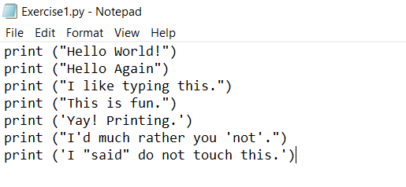
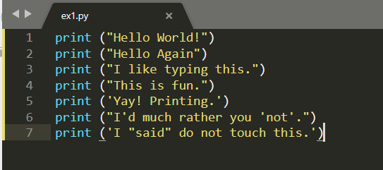
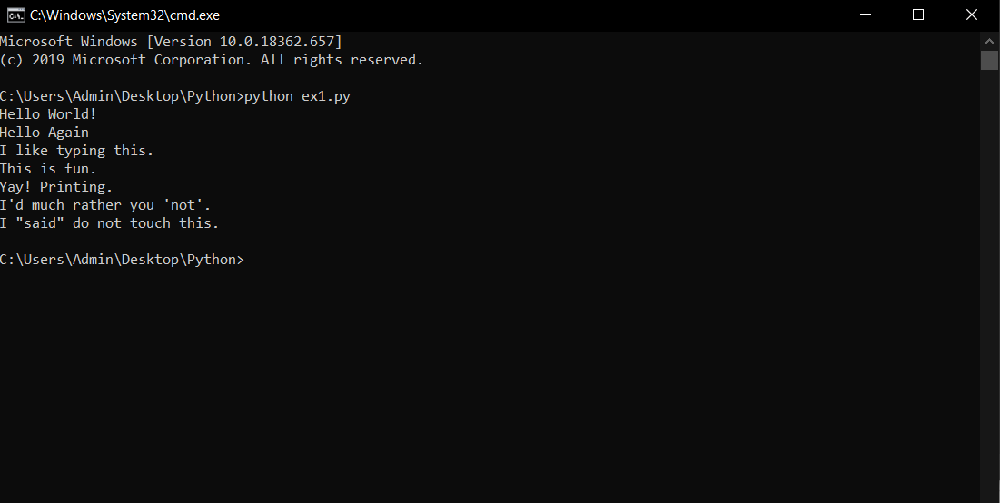
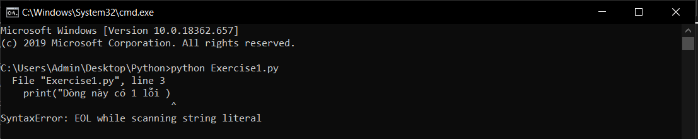
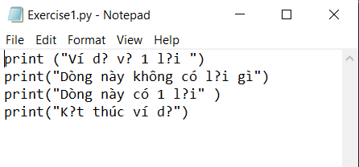
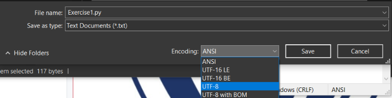

# Chương trình đầu tiên #  
Hãy chắc rằng bạn đã cài đặt và biết cách làm việc với 1 file python(.py), bởi nếu bạn không biết những điều đó thì bạn sẽ chẳng thu được gì từ bài viết này. Nếu bạn đã biết những điều trên thì bắt đầu với chương trình đầu tiên nào.  
Hãy tạo 1 file (.py) và copy đoạn code sau vào:  
```python
print ("Hello World!")
print ("Hello Again")
print ("I like typing this.")
print ("This is fun.")
print ('Yay! Printing.')
print ("I'd much rather you 'not'.")
print ('I "said" do not touch this.')
```
Mỗi text editor khác nhau thì đoạn code bạn nhập vào sẽ trông khác nhau.  
>Ví dụ khi bạn viết code bằng notepad thì nó trông như thế này:  
  

>Còn đây là khi dùng SublineText:  
  

>Mặc dù biết chỉ cần code chạy đúng là được nhưng thêm ít màu mè và đánh số dòng cũng tiện cho việc theo dõi code phải không nào.

Sau khi nhập đoạn code đó vào hãy mở Terminal nên và chạy file nào.
```
python ex1.py
```
Khi chạy chương trình bạn sẽ thấy kết quả như sau:  


Nếu kết quả của bạn cũng giống như vậy thì chúc mừng bạn đã chạy thành công chương trình, nếu bạn gặp lỗi cũng đừng lo lắng quá, hãy xem 1 ví dụ về lỗi chương trình:

Hãy nhìn vào output nó sẽ cho chúng ta biết lỗi xuất hiện ở dòng nào, trong ví dụ này lỗi xuất hiện ở dòng thứ 3.
>File "Exercise1.py", line 3  

Nếu bạn để ý kĩ sẽ thấy dấu (^) chỉ ra rằng trong dòng thứ 3 thì lỗi nằm ở vị trí đó. Ở đây lỗi này là do thiếu dấu nháy (") kết thúc chuỗi. Nếu bạn không thể nhận ra được lỗi sau khi xem output thì hãy copy thông báo lỗi và tìm kiếm nó trên google, có thể cũng sẽ có người mắc lỗi đó và từ đó bạn có thể sửa được.
>SyntaxError: EOL while scanning string literal

Nếu bạn gặp vấn đề khi viết tiếng việt mà khi lưu file lại bị lỗi hiển thị 
Cách khắc phục: Khi lưu file hãy chuyển encoding của file đó về UTF-8


# Những điều mà bạn đọc thường hay thắc mắc #
Đây là những câu hỏi mà chúng tôi thu thập được trong thực tế của nhiều người khi đọc bài viết này, bạn có thể gặp phải 1 số trong này vì vậy chúng tôi đã thông kê và trả lời.

### Có nên sử dụng IDLE để lập trình python không? #
Câu trả lời là không, bạn nên sử dụng Terminal trên OSX và PowerShell trên Windows, giống như tôi làm vậy. Bời vì những bài viết sau này tôi đều làm việc trên đó. Nếu bạn không biết cách sử dụng Terminal hãy đọc lại bài viết trước.
### Làm như thế nào để chương trình của tôi có màu sắc đep, dễ nhìn hơn ? ###
Hãy cài 1 số Editor text như Notepad++, SublineText, ...và hãy nhớ lưu file dưới dạng(.py)  

### Tôi không thể chạy được file python trên máy của mình ###
Hãy chắc rằng python đã được cài đặt vào trong máy của bạn. Có thể video này sẽ giúp ích cho bạn [https://www.youtube.com/watch?v=ndNlFy-5GKA](https://www.youtube.com/watch?v=ndNlFy-5GKA)

# Bài tập #
1. Làm cho chương trình của bạn hiển thị 1 nội dung khác.
2. Làm cho nội dung của bạn chỉ hiện thị trên 1 dòng.
3. Hãy thử thêm # vào đầu dòng xem nó đã làm gì?


Hãy cố gắng tự tìm hiểu những điều trên, bởi tự học mới là 1 kỹ năng quan trọng của lập trình viên.
