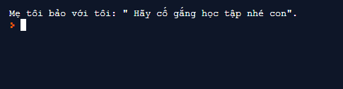
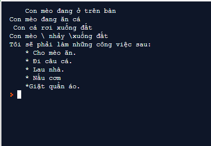

# Ký tự thoát trong python #
Ở bài 9 chúng ta đã cùng nhau tìm hiểu về những điều thú vị của câu lệnh print trong python. Trong đó chũng ta có hai ví dụ về cách tạo ra một chuỗi trong nhiều dòng.

```Python
thu = "Hai Ba Tư Năm Sau Bẩy ChủNhật "
thang = "Một\nHai\nBa\nTư\nNăm\nSáu\nBẩy\nTám\nChín\nMười\nMườimột\nMườihai"
print("Đây là nhưng thứ trong tuần: ",thu)
print("Đây là những tháng trong năm: ",thang)
print("""
Có gì đó bạn cảm thấy thú vị ở đây không?
Với 3 dấu " chúng ta có thể ghi bao nhiêu tùy thích.
Có thể là 3 dòng, cũng có thể 4 hay 5.
""")
```

Bằng cách sử dụng "\n" chúng ta đã có thể tạo ra một chuỗi trên cùng nhiều dòng.

Bây giờ hãy thử tưởng tượng bạn phải thực hiện công việc in ra màn hình một chích dẫn kiểu như: "Mẹ bảo với tôi: "Hãy cố gắng học tập nhé con"". vậy bạn phải làm như thế nào?

Rất đơn giản việc bạn phải làm chỉ là thay ký tự " trong chích dẫn bằng ký tự "\\"" như dưới đây:

```Python
print("Mẹ tôi bảo tôi: \"Hãy cố gắng học tập nhé con\".")
```

Đây là kết quả:



Qua hai ví dụ vừa ròi bạn đã biết ký tự thoát trong python là gì chưa?

*Ký tự thoát trong trong python là những ký tự bắt đầu bằng "\\"(dấu gạch chéo ngược) như "\n", "\\"" trong 2 ví dụ vừa rồi.*

Dưới đây là danh sách các ký tự thoát trong python:

|Ký tự thoát|Mô tả|
|:---------:|:----|
|\n|Xuống dòng|
|\\|Dấu gạch chéo ngược|
|\'|Dấu nháy đơn|
|\"|Dấu nháy kép|
|\a|ASCII Bell|
|\b|ASCII Backspace|
|\f|ASCII Formfeed|
|\r|ASCII Carriage Return|
|\t|ASCII Horizontal Tab|
|\v|ASCII Vertical Tab|
|\ooo|Character with octal value ooo|
|\xHH|Character with hexadecimal value HH|
|\uxxxx|Character with 16-bit hex value xxxx (Unicode only)|
|\Uxxxxxxxx|Character with 32-bit hex value xxxxxxxx (Unicode only)|

**Ví dụ:**

```Python
cat_1 = "\tCon mèo đang ở trên bàn."
cat_2 = "Con mèo đang ăn cá.\n Con cá rơi xuống đất."
cat_3 = "Con mèo\\ nhảy \\ xuống đất"
cong_viec = """Tôi sẽ phải làm những công việc sau:
\t* Cho mèo ăn.
\t* Đi câu cá.
\t* Lau nhà.
\t* Nấu cơm.\n\t* Giặt quần áo.
"""
print(cat_1)
print(cat_2)
print(cat_3)
print(cong_viec)
```

**Kết quả:**



### Thắc mắc bạn đọc ###

**1. Ký tự "\\\\" có gì đặc biệt không?**

  Không, nó chỉ đơn giản là ký tự giúp bạn hiển thị dấu gạch chéo ngược.
  >Ví dụ:
  > ```Python
  >  print("C:\\Python32\\Lib")  
  >  # kết quả: C:\Python\Lib
  >```

**2. Tại sao khi tôi viết "//", "/n" thì nó lại nó không hoạt động?**

  Tất nhiên là nó sẽ khoogn hoạt dộng rồi, bởi vì bãn đang sử dụng dấu gạch chéo"/", chứ không phải dấu gạch  chéo ngược "\\" như trong bài viết này.

**3. Khi tôi sử dụng %r thì ký tự thoát không hoạt dộng, vì sao thế?**

  Bởi vì %r dùng để định dạng dữ liệu dạng thô, nó không phân biệt được đâu là ký tự thoát, nó cho rằng tất cả những gì nằm trong dấu " "(ngoặc kép) đều là nguyên văn của bạn muốn.
