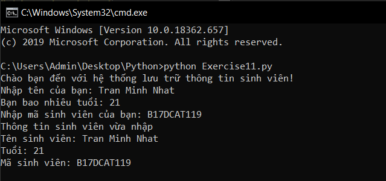

# Vào dữ liệu trong python #
Sau khi làm quen với câu lệnh print trong python, nó khá là đơn giản phải không, nhưng những điều đơn giản thì hay nhàm chán. Thế nên hôm nay chũng ta sẽ học đến cách nhận dữ liệu từ ngoài vào chương trình của bạn. Điều này có chút khó khăn nhưng nó sẽ có ích với bạn trong 1 số bài tập.

Hầu hết những chương trình đều làm những việc sau:
1. Lấy dữ liệu đầu vào từ một người.
2. Sử dụng, thay đổi dữ liệu đó để làm bất kỳ việc gì có thể.
3. In ra kết quả sau những gì đã làm.

Từ trước đến nay những chương trình của bạn chỉ biết in kết quả ra màn hình, nhưng nó không thể nhận vào bất kỳ dữ liệu nào khi chạy cả, vậy phải làm như thế nào để nhận dữ liệu đầu vào.
Hãy xem 1 ví dụ sau:

```python
print("Chào bạn đến với hệ thống lưu trữ thông tin sinh viên!")
name = input("Nhập tên của bạn: ")
age = input("Bạn bao nhiêu tuổi: ")
id_student = input("Nhập mã sinh viên của bạn: ")
print("Thông tin sinh viên vừa nhập\nTên sinh viên: %s\nTuổi: %s\nMã sinh viên: %s" %(name,age,id_student))
```

Kết quả sẽ như sau:



### Thắc mắc bạn đọc ###

**1. Làm như thế nào để dữ liệu nhập vào là kiểu number?**
  Một lời khuyên nho nhỏ cho bạn, thử dùng int(input()) xem. Nó sẽ nhận vào 1 string và chuyển nó sang kiểu dữ liệu number.

**2. Sự khác biệt giữa input và raw_input là gì?**
  Ở python 2 thì input() không những nhận vào dữ liệu và nó còn tao tác luôn với dữ liệu:
  >Ví dụ:
  >```python
  > exp = input()
  >#Nhập vào 1+2 => exp = 3
  > exp_1 = raw_input()
  >#Nhập vào 1+2 => exp_1 = "1+2"
  >```

  Điều này làm ảnh hưởng đến sự bảo mật của dữ liệu.
  Ở python 3 thì raw_input() đã bị thay thế bằng input(). Trong những bài viết của mình dầu dùng python 3. 
