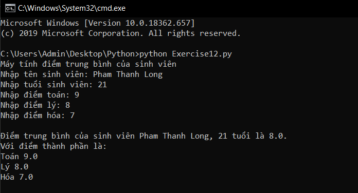
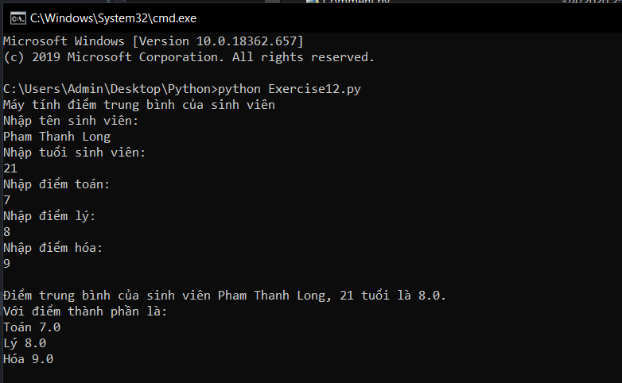

# Lời nhắc của Input trong python #

Ở bài trước chúng ta đã học được cách sử dụng input() để nhập dữ liệu vào. Bài hôm nay chúng ta sẽ tiếp tục học về câu lệnh input() trong python.

Trong python hay bất kì ngôn ngữ lập trình nào khác, "lời nhắc" là thứ rất quan trọng, nó giúp cho người dùng biết phải làm gì, ở bài học hôm nay "lời nhắc" giúp chúng ta biết phải nhập dữ liệu gì vào.

Mình 2 ví dụ về lời nhắc sau đây:

>Ví dụ 1
>```python
>print("Máy tính điểm trung bình của sinh viên")
>name = input("Nhập tên sinh viên: ")
>age = input("Nhập tuổi sinh viên: ")
>math_point = float(input("Nhập điểm toán: "))
>physic_point = float(input("Nhập điểm lý: "))
>chemic_point = float(input("Nhập điểm hóa: "))
>avg_point = (math_point + physic_point + chemic_point)/3
>tong_ket = """\nĐiểm trung bình của sinh viên %s, %s tuổi là %s.
Với điểm thành phần là:
Toán %s
Lý %s
Hóa %s """ %(name, age, avg_point, math_point, physic_point, chemic_point)
>print(tong_ket)
>```

>Ví dụ 2
>```python
>print("Máy tính điểm trung bình của sinh viên")
>print("Nhập tên sinh viên: ")
>name = input()
>print("Nhập tuổi sinh viên: ")
>age = int(input())
>print("Nhập điểm toán: ")
>math_point = float(input())
>print("Nhập điểm lý: ")
>physic_point = float(input())
>print("Nhập điểm hóa: ")
>chemic_point = float(input())
>avg_point = (math_point + physic_point + chemic_point)/3
>tong_ket = """\nĐiểm trung bình của sinh viên %s, %d tuổi là %f.
Với điểm thành phần là:
Toán %f
Lý %f
Hóa %f """ %(name, age, avg_point, math_point, physic_point, chemic_point)
>print(tong_ket)
>```

>Ví dụ 1 có kết quả như sau:
>
>

>Còn đây là của ví dụ 2:
>
>

*Nhìn từ 2 ví dụ các bạn có thể dễ dàng nhận thấy sự khác biệt của chúng, theo ví dụ 1 thì khi nhập dữ liệu chúng ta được nhập trên cùng 1 hàng với dòng thông tin, còn ở ví dụ 2 thì cần xuống dòng. Thêm nữa ở ví dụ 2 chúng ta phải dùng câu lệnh print để in ra lời nhắc để nhập dữ liệu điều này khiến cho code của chúng ta dài hơn. Ở ví dụ 1 phần lời nhắc được viết bên trong câu lệnh input("Lời nhắc"), thường thì các lập trình viên sẽ hay dử dụng theo ví dụ 1 hơn, họ cũng có thể phối hợp giữa cả 2 loại để làm cho phần output của chương trình đẹp hơn.*

### Thắc mắc từ bạn đọc ###

**1. Tại sao tôi không thể viết print("Nhập tuổi của bạn: "), input()?**

  Đơn giản vì python không hiểu được điều bạn muốn nó thực hiện.
