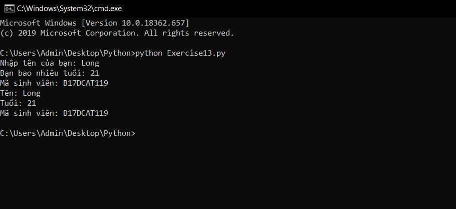
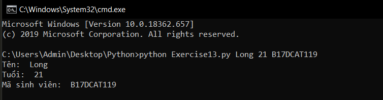

# Đối số của một chương trình python #

Trong bài học trước chúng ta đã biết 1 cách để truyền giá trị đầu vào cho các biến cho một chương trình python, bài hôm nay chúng ta sẽ học thêm một cách nữa để truyền giá trị vào cho các biến.

Có lẽ từ trước đến nay các bạn đã quen với cách chạy một chương trình python bằng form mẫu python tên_chương_trình.py nhưng sau bài hôm nay các bạn sẽ có thêm một cách thú vị hơn để chạy một chương trình, bạn cũng có thể đồng thời truyền tham số đầu vào luôn cho các biến trong chương trình của mình.

Chúng ta có một ví dụ để bạn dễ hình dung: Giả sử bạn phải nhập vào tên của bạn, tuổi, mã sinh viên của bạn để in chúng ra màn hình. Áp dụng những gì đã học từ các bài trước các bạn có thể dễ dàng code được 1 chương trình như vậy

```python
name = input("Nhập tên của bạn: ")
age = int(input("Bạn bao nhiêu tuổi: "))
id_student = input("Mã sinh viên: ")
print("Tên: %s\nTuổi: %d\nMã sinh viên: %s" %(name, age, id_student))
```
Và nó sẽ có kết quả như thế này:



Đến đây hãy thử chạy đoạn code dưới đây, và hãy thử chạy theo form khác tất cả các lần trước đây: python <tên_chương_trình.py> <tên> <tuổi> <mã_sinh_viên>

```python
from sys import argv
script, name, age, id_student = argv
print("Tên: ", name)
print("Tuổi: ", age)
print("Mã sinh viên: ", id_student)
```

Cùng nhìn kết quả nào:



Thật thú vị phải không, thay vì phải nhập dữ liệu thông qua input() và lời nhắc bạn hoàn toàn có thể nhập dữ liệu song song khi chạy chương trình.

Quay trở lại ví dụ:
 - Ở dòng thứ nhất chúng ta có câu lệnh **"from sys import argv"**, câu lệnh này sẽ giúp chương trình của chúng ta nhận thêm một số đối số khi chạy chương trình(giống như thông số của chương trình vậy) và mặc định trong đó sẽ có tên của chương trình đó là *file script*, và những thông số đó sẽ được gói gọn trong một tuple có tên là argv(na ná giống với list).

 - Dòng thứ 2 "script, name, age, id_student = argv", câu lệnh này nhằm mục đích giải nén những thông số đầu vào được lưu trong argv khi chạy chương trình và gán cho các biến script, name, age, id_student để bạn có thể thao tác trong chương trình.

Đến đây bạn đã biết cách để truyền thông số cho chương trình của mình khi chạy chương trình rồi chứ, hãy thử làm nhiều ví dụ khác xem sao.

### Thắc mắc bạn đọc ###

**1. Khi làm ví dụ giống như bài viết, lúc chạy chương trình có thông báo lỗi "ValueError: need more than 3 values to unpack", hãy giải thích tại sao lại có lỗi này?**

  Hãy xem lại phần thông số nhập vào khi chạy chương trình của bạn có thiếu cái nào không. Lỗi này sảy ra khi bạn giải nén biến argv mà không đủ giá trị để gán cho các biến. Ví dụ như khi chạy file Exercise13.py bạn nhập vào thêm 2 thông số "python Exercise13.py Long 21" nhưng trong chương trình bạn lại giải nén ra 4 biến "script, name, age, id_student = argv" thì đương nhiên nó sẽ lỗi bởi vì làm gì có giá trị để gán cho biến id_student.
  
**2. Sự khác biệt giữa input() và argv là gì?**

    Nếu bạn muốn thêm thông số luôn khi bắt đầu chạy chương trình thì sử dụng argv, ngược lại bạn ưa thích nhập dữ liệu vào khi chương trình đang chạy thì sử dụng input().
