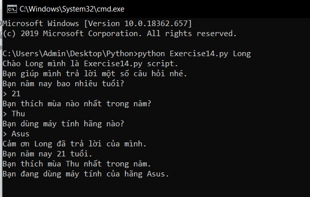

# Lời nhắc nhập dữ liệu và cách xử lý dữ liệu nhập vào trong python #

Hãy làm bài tập dưới đây, áp dụng cả argv và input() để hỏi người dùng một số thông tin cụ thể. Bạn sẽ cần đến kỹ năng này trong những bài học về nhập xuất file về sau. Trong bài tập này, chúng ta sử dụng input() với lời nhắc đơn giản hơn là "> ".

*Đề bài: Tạo một chương trình python, chạy chương trình đồng thời truyền vào tham số là tên người dùng, hỏi một số câu hỏi với người dùng ví dụ như:*
  - *Người dùng bao nhiêu tuổi?*
  - *Người dùng thích mùa nào nhất trong năm?*
  - *Người dùng sử dụng hãng máy tính nào?*

*Sau đó in ra những thông tin vừa mới hỏi được.*

**Đây là code tham khảo**

```python
from sys import argv
script, user_name = argv
prompting = '> ' #Biến lưu lời nhắc
print("Chào %s mình là %s script." %(user_name,script))
print("Bạn giúp mình trả lời một số câu hỏi nhé.")
print("Bạn năm nay bao nhiêu tuổi?")
age = int(input(prompting))
print("Bạn thích mùa nào nhất trong năm?")
season = input(prompting)
print("Bạn dùng máy tính hãng nào?")
kind_pc = input(prompting)
result = """Cảm ơn %s đã trả lời của mình.
Bạn năm nay %d tuổi.
Bạn thích mùa %s nhất trong năm.
Bạn đang dùng máy tính của hãng %s.
"""  %(user_name, age, season, kind_pc)
print(result)
```

**Sau khi chạy chương trình sẽ có kết quả tương tự như này:**



Lưu ý rằng trong bài tập này biến prompting để lưu lời nhắc cho những câu lệnh input(), trong nhiều trường hợp lời nhắc được sử dụng đi sử dụng lại thì hãy làm như thế để tiết kiệm thời gian, ngoài ra bạn cũng có thể thay đổi tất cả các lời nhắc bằng cách thay đổi giá trị biến prompting.

### Thắc mắc bạn đọc ###

**1. Có thể sử dụng dấu " " cho biến prompting không?**
  Tất nhiên rồi, hãy thử xem.

**2. Tôi gặp lỗi "NameError: name 'prompt' is not defined" khi tôi chạy chương trình, phải làm như thế nào?**
  Hãy xem lại tên biến dùng để lưu lời nhắc của bạn, chắc rằng bạn đã gọi đúng tên biến đó.
