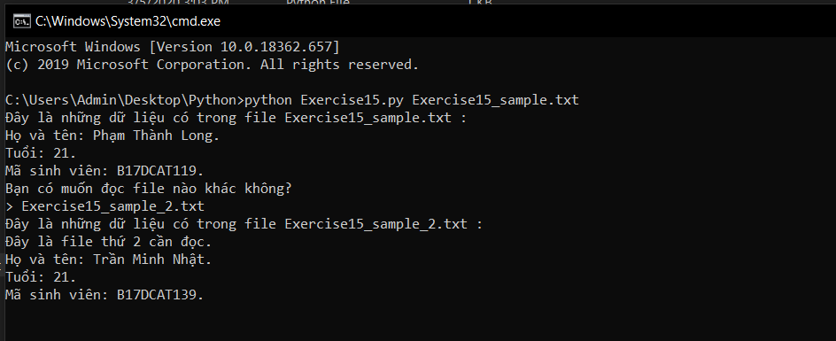

# Đọc file trong python #

Tất cả những gì bạn đã học về input() và argv là điều cần thiết để bắt đầu học về đọc file. Bạn có thể phải làm bài tập về dạng này nhiểu nhất, vì thế hãy cố gắng hiểu kĩ về nó. Bên cạnh đó, làm việc với file rất dễ dàng gây mất dữ liệu nếu bạn không cẩn thận.

Trong bài hôm nay bạn phải làm việc với 2 file, một là Exercise15.py, hai là Exercise15_sample.txt. File thứ hai không phải là một tập lệnh mà nó chỉ đơn giản là tập văn bản, chúng ta sẽ đọc dữ liệu từ file này.

Hãy tạo file Exercise15_sample.txt cà nhập văn bản mà bạn muốn in ra, nó có thể đơn giản là tên bạn, tuổi, mã sinh viên.

```text
  Họ và tên: Phạm Thành Long.
  Tuổi: 21.
  Mã sinh viên: B17DCAT119.
```

Những gì bày này yêu cầu chỉ là mở file txt ra và đọc nó trong chương trình, thế nhưng chúng tôi cũng không chỉ muốn bạn ràng buộc file được đọc mà chúng tôi còn muốn bạn hãy để người chạy chương trình chọn file để đọc như ví dụ sau đây:

```python
from sys import argv
script, file_name = argv
prompt = '> '
txt = open(file_name, encoding = "utf8")
print("Đây là những dữ liệu có trong file %s :" %file_name)
print(txt.read())
print("Bạn có muốn đọc file nào khác không?")
file_name_again = input(prompt)
txt_again = open(file_name_again, encoding = "utf8")
print("Đây là những dữ liệu có trong file %s :" %file_name_again)
print(txt_again.read())
```

Kết quả:



### Thắc mắc bạn đọc ###

**1. Khi chạy chương trình tôi gặp lỗi "UnicodeDecodeError: 'charmap' codec can't decode byte X in position Y: character maps to <undefined>", hãy giải thích cho tôi đây là lỗi gì, cách khắc phục ra sao?**

  Đây là lỗi về encoding, nó sảy ra khi nội dung file mà bạn muốn đọc ở dạng encoding khác chương trình. Để khắc phục lỗi này khi mở file hãy thêm encoding của file cần mở như trong ví dụ.

**2. Tại sao không có lỗi khi tôi mở một file nhiều lần?**

  Đây là một điều thú vị của python, nó hỗ trợ mở file nhiều lần để phục vụ những trường hợp cần thiết trong thực tiễn.
