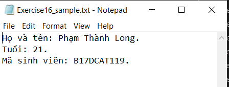
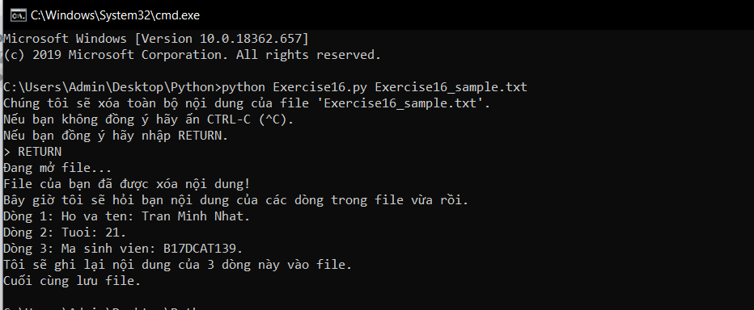
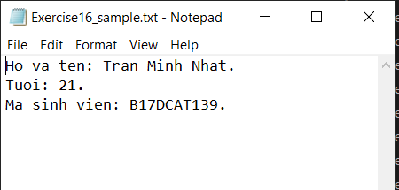

# Những hàm, phương thức thao tác với file trong python #

Nếu bạn đã học bài trước và đã tìm hiểu thêm về đọc, ghi file trong python thì có thể bạn sẽ thấy tất cả những hàm, phương thức có thể cung cấp cho việc thao tác với file. Dưới đây là danh sách các hàm, phương thức mà chúng tôi muốn bạn ghi nhớ nó:

- close(): Đóng file đã mở trong chương trình. Nó sẽ lưu lại những dữ liệu có trong file hiện tại, nó giống với với việc save file trong các editor.
- read(): Đây là hàm đọc file mà chúng ta đã học trong bài trước đó.
- readline(): Cũng là hàm đọc file nhưng là đọc dữ liệu trên một dòng ở trong file.
- truncate(): Cắt gọn kích cỡ file.
- write(): Ghi nội dung vào file.  


Dưới đây có một ví du nho nhỏ về việc sử dụng những hàm, phương thức nêu trên.

```python
from sys import argv
script, file_name = argv
print ("Chúng tôi sẽ xóa toàn bộ nội dung của file %r." % file_name)
print ("Nếu bạn không đồng ý hãy ấn CTRL-C (^C).")
print ("Nếu bạn đồng ý hãy nhập RETURN.")
input("> ")
print ("Đang mở file...")
target = open(file_name, 'w')
print ("File của bạn đã được xóa nội dung!")
target.truncate()
print ("Bây giờ tôi sẽ hỏi bạn nội dung của các dòng trong file vừa rồi.")
line1 = input("Dòng 1: ")
line2 = input("Dòng 2: ")
line3 = input("Dòng 3: ")
print ("Tôi sẽ ghi lại nội dung của 3 dòng này vào file.")
target.write(line1)
target.write("\n")
target.write(line2)
target.write("\n")
target.write(line3)
target.write("\n")
print ("Cuối cùng lưu file.")
target.close()
```

Đây là nội dung file cần ghi lúc đầu:



Đây là kết quả chạy chương trình:



Đây là nội dung file sau khi ghi:



Về cú pháp sử dụng, cũng như những điều lưu ý về các hàm, phương thức trên bạn hãy tự tìm hiểu trên google nhé.

### Thắc mắc bạn đọc ###

**1. Nghĩa của tham số 'w' trong open() là gì?**
  Nếu bạn không biết thì đó là một chế dộ khi mở file, ở đây 'w' là viết tắt của write, có nghĩa là chế độ mở file là 'mở để ghi file'.

**2. Tại sao khi đọc file thì hàm open() không cần tham số chế độ mở file là 'r'?**
  Nếu bạn không truyền vào tham số chế độ mở file thì nó mặc định sẽ là 'r'.
