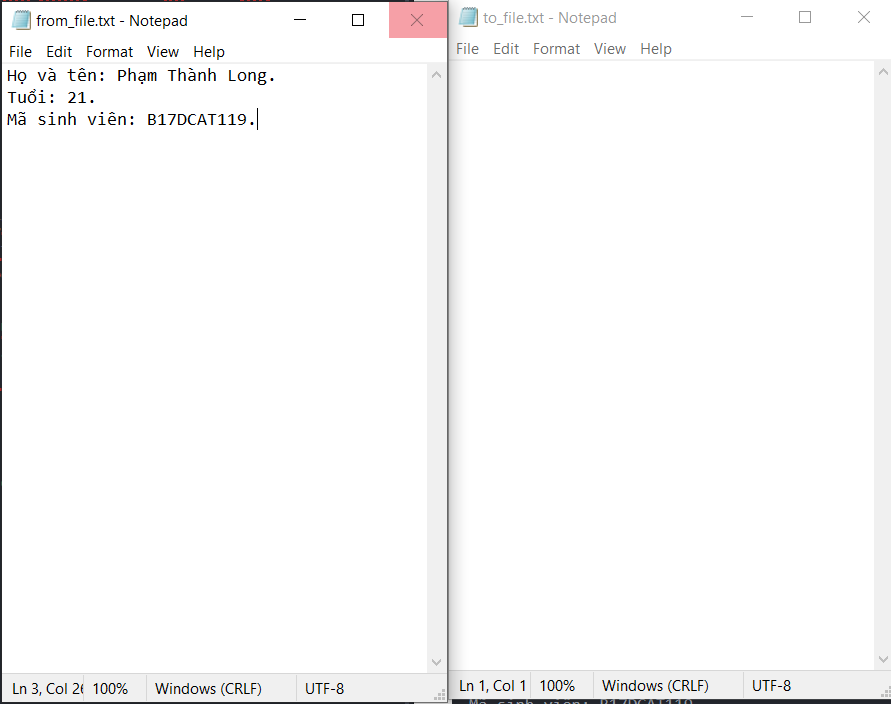
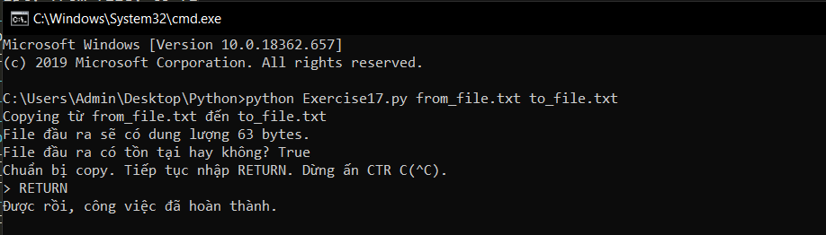
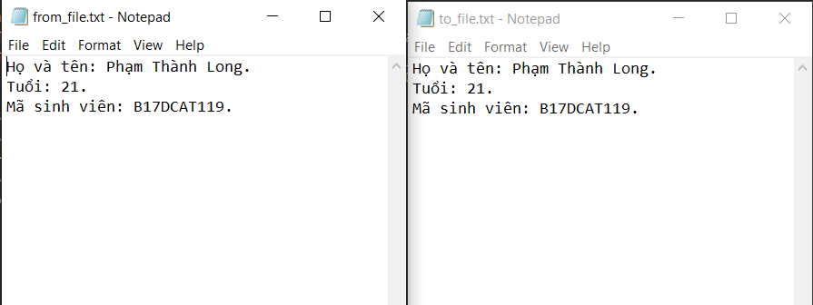

# File trong python #

Hai bài trước chúng ta đã học về đọc, ghi và một số chức năng khác để thao tác với file trong python, bài hôm nay hãy cùng tìm hiểu nhiều điều hay ho hơn nữa về file trong python nhé.

Bây giờ chúng ta sẽ viết một chương trình python để copy nội dung fila này sang file khác. Chương trình này rất ngắn và đơn giản nhưng nó có thể cho bạn thêm nhiều ý tưởng hay ho hơn về file.

Cùng thực hiện nào.

```python
from sys import argv
from os.path import exists
script, from_file, to_file = argv
print ("Copying từ %s đến %s" % (from_file, to_file))
input_file = open(from_file, encoding = "utf8")
data_file = input_file.read()
print ("File đầu ra sẽ có dung lượng %d bytes." % len(data_file))
print ("File đầu ra có tồn tại hay không? %r" % exists(to_file))
print ("Chuẩn bị copy. Tiếp tục nhập RETURN. Dừng ấn CTR C(^C).")
input('> ')
out_file = open(to_file, 'w', encoding = "utf8")
out_file.write(data_file)
print ("Được rồi, công việc đã hoàn thành.")
out_file.close()
input_file.close()
```
Đây là nội dung from_file, to_file trước khi thực hiện chương trình.



Kết quả khi chạy chương trình:



Nội dung 2 file sau khi chạy chương trình:


