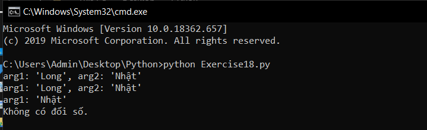

# Hàm trong python #

Trong bài học cách đọc, ghi file chúng ta đã tiếp xúc với những hàm, phương thức dùng để thao tác với file như là read(), write(), truncate(),... Nhưng đó đều là các hàm của hệ thống, việc của bạn chỉ là sử dụng chúng. Bài hôm nay chúng ta sẽ học cách tự tay viết một hàm trong python.

Để khai báo một hàm trong python chúng ta sử dụng form:

**def <tên_hàm>(<đối_số_1><đối_số_2>...<đối_số_n>):
<Nội_dung_hàm>**

Hãy tham khảo ví dụ dưới đây để hiểu rõ hơn nhé.

```python
# Ví dụ truyền đối số giống truyền thông số argv cho chương trình.
def print_two(*args):
  arg1, arg2 = args  
  print ("arg1: %r, arg2: %r" %(arg1, arg2))
# Vì việc sử dụng *args khá là vô nghĩa, vậy nên bạn cũng có thể bỏ.
def print_two_again(arg1, arg2):
  print ("arg1: %r, arg2: %r" % (arg1, arg2))
# Ví dụ hàm chỉ có 1 đối số
def print_one(arg1):
  print ("arg1: %r" % arg1)
# Ví dụ hàm không có đối số
def print_none():
  print ("Không có đối số.")
# Khi cần dùng đến hàm chũng ta gọi tên chúng rồi truyền vào đối số.
print_two("Long","Nhật")
print_two_again("Long","Nhật")
print_one("Nhật")
print_none()
```
Kết quả thực hiện chương trình:



### Thắc mắc bạn đọc ###

**1. Quy tắc đặt tên hàm là gì?**

  Nó giống với quy tắc đặt tên biến, tên có thể bất cứ thứ gì nhưng không được bắt đầu bằng số, các ký tự trong tên có thể chữ, số hoặc dấu _ (gạch dưới).

**2. Ký tự * ở trong *args có tác dụng gì?**

  Nó dùng để tạo ra một list các đối số và khi sử dụng chúng trong thân hàm bạn cũng phải giải mã chúng ra, nó khá giống argv, nhưng khác ở chỗ đối với hàm thì nó không cần thiết cho lắm.
