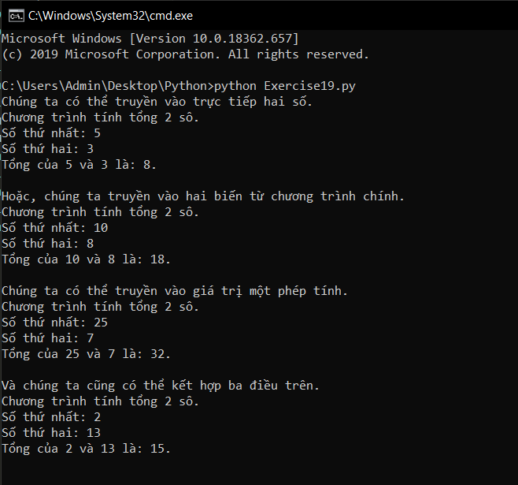

# Các cách truyền tham số vào hàm #

Có rất nhiều thứ phải học về hàm trong python, nhưng cũng đừng lo lắng quá, chỉ cần bạn chăm chỉ luyện tập cũng như tìm hiểu thêm trên mạng thì bạn sẽ làm chủ được nó thôi.

Có một vấn đề rất nhỏ đối với hàm mà bạn có thể không nhận ra, đó là việc tham số vào hàm - đó cũng là những gì mà chúng ta tìm hiểu trong bài hôm nay.

Xét ví dụ:

```python
def tinh_tong(num1, num2):
  print("Chương trình tính tổng 2 sô.")
  print("Số thứ nhất: %d" %num1)
  print("Số thứ hai: %d" %num2)
  print("Tổng của %d và %d là: %d.\n" %(num1, num2, num1 + num2))

print("Chúng ta có thể truyền vào trực tiếp hai số.")
tinh_tong(5, 3)
print("Hoặc, chúng ta truyền vào hai biến từ chương trình chính.")
number1 = 10
number2 = 8
tinh_tong(number1, number2)
print("Chúng ta có thể truyền vào giá trị một phép tính.")
tinh_tong(5 + 20, 15 - 8)
print("Và chúng ta cũng có thể kết hợp ba điều trên.")
tinh_tong(number1 - 8, number2 + 5)
```
Kết quả chương trình:



Qua ví dụ đơn giản đó, bạn có thể thấy được chúng ta có nhiều cách khác nhau để truyền tham số vào trong một hàm. Chúng ta có thể truyền vào giá trị trực tiếp, truyền thông qua biến, truyền vào biểu thức toán học, hoặc có thể kết hợp ba điều đó, và còn rất nhiều cách khác, các bạn hãy tự tìm hiểu thêm nhé.


### Thắc mắc bạn đọc ###

**1. Sẽ ra sao nếu tham số tôi truyền vào trùng tên với đối số của hàm?**

  Chương trình vẫn sẽ chạy bình thường, thế nhưng nếu bạn để tham số trùng tên với đối số nó sẽ gây hiểu lầm cho người đọc code của bạn, nó cũng có thể làm bạn nhầm lẫn trong một số trường hợp. Vì thế hãy tránh điều đó nếu thể.

**2. Đối số của hàm có giới hạn số lượng không?**

  Tất nhiên là có rồi, giới hạn của đối số trong hàm sẽ phụ thuộc vào phiên bản cảu python mà bạn cài. Trên thực tế giới hạn đối số của một hàm là 5, vì khi có 5 đối số hàm đã rất phức tạp.
