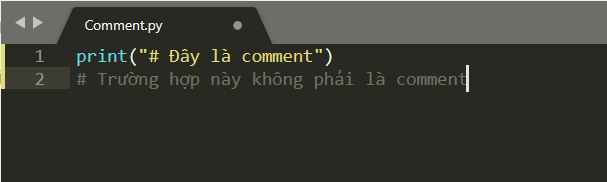
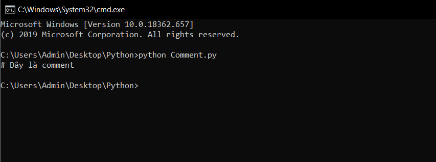
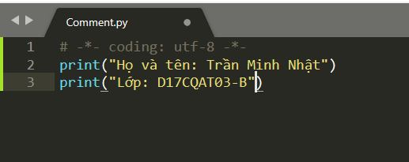
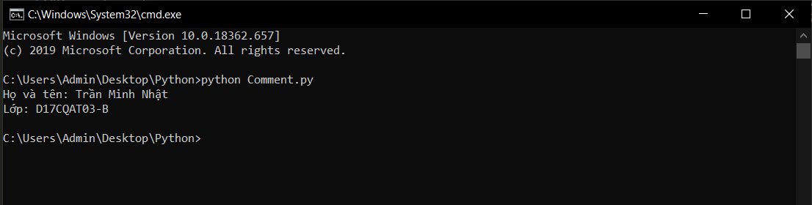

# Comments trong Python #
*Comments là 1 thứ không thể thiếu trong 1 chương trình của lập trình viên. Chúng được sử dụng để chú thích cho người đọc biết đoạn code đó làm được gì. Ngoài ra Comments còn dùng để vô hiệu hóa tạm thời 1 phần nào đó của chương trình. Bài hôm nay chúng ta sẽ tìm hiểu về cách sử dụng Comments trong python.*

**Comments trong python được sử dụng bằng cách thêm dấu # vào trước phần cần comment:**

```python
  # đây là 1 comment
  # Tất cả những gì sau dấu # đều bị python bỏ qua
  # Comment dùng để giải thích tác dụng của câu lệnh phía sau nó
  # Ví dụ:
  # In ra màn hình "Chào các bạn"
  print ("Chào các bạn")
  # Comment dùng để vô hiệu hóa 1 đoạn code
  # print("Đoạn code này bị vô hiệu hóa")
  print("Đoạn code này không bị vô hiệu hóa")  
```

**Chú ý một vài trường hợp đặc biệt**

*1. Chuỗi có dạng là 1 Comment*
  

  Ở trường hợp này, khi đặt (#) trong cặp dấu ngoặc kép (“ ”), chương trình sẽ hiểu là dấu (#) là ký tự mà chúng ta muốn in ra như một chuỗi bình thường. Do đó, nó cũng sẽ in ra dấu (#) và không bỏ qua những thứ bên phải dấu (#).

  *Kết quả chương trình:*

  

*2. Comment được tính là 1 định nghĩa*



Như trong trường hợp này là một định nghĩa về encoding UTF-8. Và đương nhiên bằng một cách nào đấy, chương trình đã hiểu định nghĩa của chúng ta

Ở ví dụ này, mình đã định nghĩa encoding UTF-8 một encoding giúp chúng ta hiển thị tiếng Việt. Và nhờ đó chúng ta có thể hiển thị được tiếng việt trên Command Prompt

Tuy nhiên, ở Sublime Text bạn đã được hỗ trợ để hiển thị tiếng việt.

*Kết quả chương trình:*


