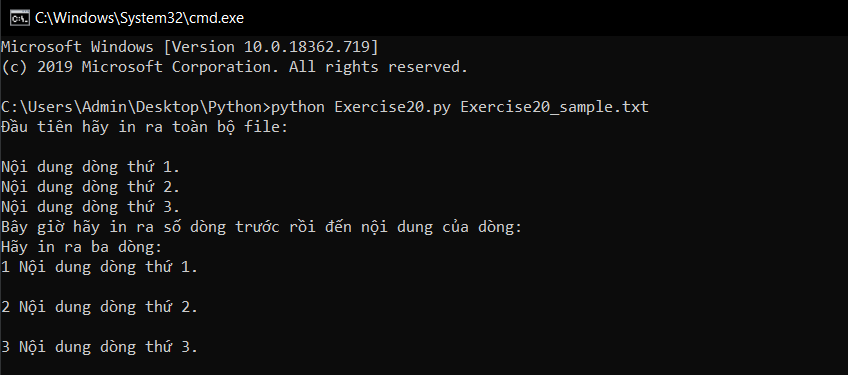

# Hàm và file #

Đến hiện tại các bạn đã học được cách làm việc với file thông qua các hàm của hệ thống như open(), read(), write(),... Bài hôm nay chúng ta sẽ làm việc với file thông qua hàm tự định nghĩa.

Dưới đây là ví dụ để bạn hiểu cách để thực hiện nó:

```python
from sys import argv
script, input_file = argv
def print_all(f):
  print (f.read())
def rewind(f):
  f.seek(0)
def print_a_line(line_count, f):
  print (line_count, f.readline())
current_file = open(input_file, encoding = "utf8")
print ("Đầu tiên hãy in ra toàn bộ file:\n")
print_all(current_file)
print ("Bây giờ hãy in ra số dòng trước rồi đến nội dung của dòng:")
rewind(current_file)
print ("Hãy in ra ba dòng:")
current_line = 1
print_a_line(current_line, current_file)
current_line = current_line + 1
print_a_line(current_line, current_file)
current_line = current_line + 1
print_a_line(current_line, current_file)
```

Hãy chạy thử nào:



Cố gắng hiểu những gì mà chúng tôi làm và hãy tự làm một số ví dụ khác xem sao.


### Thắc mắc bạn đọc ###

**1. Ký tự "f" ở trong hàm print_all() và các hàm khác là gì?**

  Đây là một đối số của hàm print_all() và các hàm khác, "f" là viết tắt của "file" - là một đối số kiểu "file", vậy nên có "f" có đầy đủ các phương thức của 1 "file" như read(), seek(), readline().

**2. Phương thức seek() của file có chức năng gì?**

  Phương thức seek() là phương thức thiết lập vị trí hiện tại của file thông qua byte. Hãy tự tìm hiểu thêm về các sử dụng cũng như những thông số của nó nhé.
