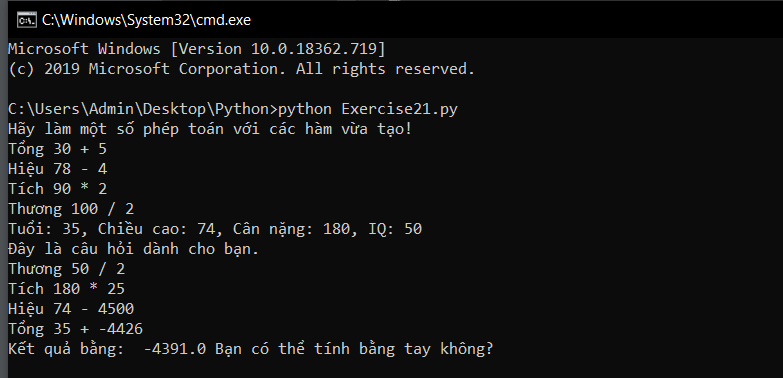

# Hàm trả về giá trị #

Trong những bài học trước, chúng ta đã tiếp xúc với hàm thế nhưng những hàm đó đều là hàm không trả về giá trị, bài hôm nay chũng ta sẽ học về hàm trả về giá trị và gán giá trị tả về cảu hàm cho một biến.

Dưới đây là một số hàm trả về giá trị đơn giản, hay quan sát chúng và tự mình tìm hiểu về chúng nhé:


```python
def add(a, b):
  print ("Tổng %d + %d" % (a, b))
  return a + b
def subtract(a, b):
  print ("Hiệu %d - %d" % (a, b))
  return a - b
def multiply(a, b):
  print ("Tích %d * %d" % (a, b))
  return a * b
def divide(a, b):
  print ("Thương %d / %d" % (a, b))
  return a / b
print ("Hãy làm một số phép toán với các hàm vừa tạo!")
age = add(30, 5)
height = subtract(78, 4)
weight = multiply(90, 2)
iq = divide(100, 2)
print ("Tuổi: %d, Chiều cao: %d, Cân nặng: %d, IQ: %d" % (age, height, weight, iq))
# Thêm một câu đố cho chương trình thú vị hơn.
print ("Đây là câu hỏi dành cho bạn.")
result = add(age, subtract(height, multiply(weight, divide(iq, 2))))
print ("Kết quả bằng: ", result, "Bạn có thể tính bằng tay không?")
```

Chạy thử nào:




### Thắc mắc bạn đọc ###

**1. Tại sao python lại in ra thứ tự các công thức, các hàm ngược?**

  Thứ nhất, nếu bạn thực hiện phép tính bằng tay thì bạn sẽ phải chia nhỏ nhỏ chúng ra, bạn sẽ phải tính từ trong ra ngoài và python cũng vậy, thế nên ở đây python không phải in "ngược" mầ chúng in "từ trong ra ngoài".

**2. Làm thế nào để tôi có thể nhập vào một số thực để python hiểu?**

  Tương tự như cách nhập vào một số nguyên bằng int(input()), thì đối với số thực bạn dùng float(input()).
