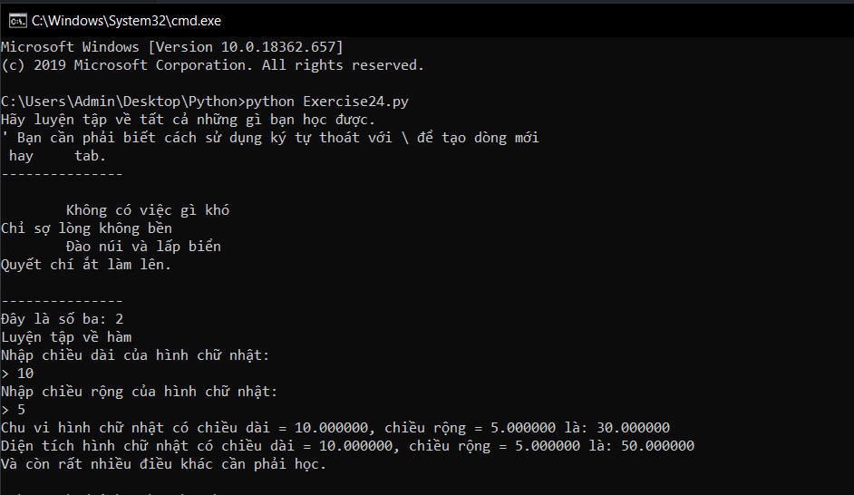

# Thực hành vền những kiến thức đã học #

Đây là bài viết cuối cùng trong một chuỗi các bài viết hướng dẫn cách học tập python hiệu quả. Bài hôm nay chúng ta luyện tập lại những gì mà bạn học được.

```python
print("Hãy luyện tập về tất cả những gì bạn học được.")
print("\' Bạn cần phải biết cách sử dụng ký tự thoát với \\ để tạo dòng mới \n hay \t tab.")
poem = """
\tKhông có việc gì khó
Chỉ sợ lòng không bền
\tĐào núi và lấp biển
Quyết chí ắt làm lên.
"""
print("---------------")
print(poem)
print("---------------")

ba = 10 - 4 + 2 - 6
print("Đây là số ba: %s" %ba)
print("Luyện tập về hàm")
def hcn(chieu_dai, chieu_rong):
  dien_tich = chieu_dai * chieu_rong
  chu_vi = (chieu_dai + chieu_rong) * 2
  return chu_vi, dien_tich
print("Nhập chiều dài của hình chữ nhật:")
dai = float(input('> '))
print("Nhập chiều rộng của hình chữ nhật:")
rong = float(input('> '))
chu_vi, dien_tich = hcn(dai,rong)
print("Chu vi hình chữ nhật có chiều dài = %f, chiều rộng = %f là: %f" %(dai,rong,chu_vi))
print("Diện tích hình chữ nhật có chiều dài = %f, chiều rộng = %f là: %f" %(dai,rong,dien_tich))
print("Và còn rất nhiều điều khác cần phải học.")
```

Kết quả chương trình:



Hãy tự luyện tập thêm nhé các bạn, bởi luyện tập là thứ quan trọng nhất để giúp bạn học tập tốt.

### Thắc mắc bạn đọc ###

**1. Tại sao hàm hcn() có đối số là chieu_dai và chieu_rong mà khi gọi lại truyền vào dai và rong?**

  Có lẽ bạn vẫn chưa hiểu rõ lắm về hàm, ở đây chieu_dai và chieu_rong chỉ là đối số để thao tác trong hàm, còn khi gọi bạn hoàn toàn có thể truyền vào các tham số có tên gọi khác chỉ cần đúng thứ tự thực hiện yêu cầu là được.
