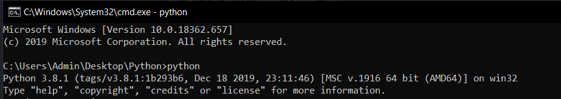
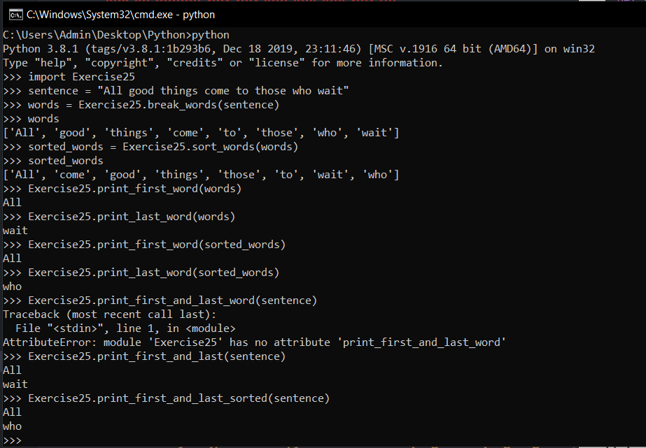

# Tiếp tục thự hành #

Nối tiếp bài hôm trước, ở bài này chúng ta lại cùng nhau ôn lại những gì đã học được về hàm và biến, để đảm bảo bạn biết rõ về chúng. Khác với các bài trước, bài hôm nay bạn chỉ việc copy đoạn code lại, chạy nó và cố gắng hiểu nó.

```python
def break_words(stuff):
 """Hàm này sẽ giúp chúng ta tách cách từ ra."""
 words = stuff.split(' ')
 return words
def sort_words(words):
 """Sắp xếp các từ."""
 return sorted(words)
def print_first_word(words):
 """In ra từ đầu tiên trong câu."""
 word = words.pop(0)
 print(word)
def print_last_word(words):
 """In ra từ cuối cùng trong câu."""
 word = words.pop(-1)
 print(word)
def sort_sentence(sentence):
 """Trả về nguyên câu sau khi sắp xếp các từ."""
 words = break_words(sentence)
 return sort_words(words)
def print_first_and_last(sentence):
 """In ra từ đầu và cuối của câu trước khi sắp xếp."""
 words = break_words(sentence)
 print_first_word(words)
 print_last_word(words)
def print_first_and_last_sorted(sentence):
 """In ra từ đầu và cuối sau khi sắp xếp câu."""
 words = sort_sentence(sentence)
 print_first_word(words)
 print_last_word(words)
```

Sau khi copy xong hãy thử chạy nó với form: python  Exercise25.py, nếu xuất hiện lỗi thì sửa lại cho đúng.

Một khi bạn đã tìm và sửa được những chỗ sai, thì có phải bạn thắc mắc sao không có kết quả gii đúng không?

Hãy theo dõi cách tôi làm nhé:

**Trước hết hãy nhập từ khóa python để xuất hiện giao diện giống trong hình:**



**Sau đó hãy làm theo từng bước như hình dưới đây:**



Hãy chia nhỏ từng dòng ra để tôi có thể giải thích cho bạn hiểu:

- Dòng thứ 4: "import Exercise25".

  Nó giống như các lần mà bạn nhập python Exercise25.py, nhưng ở đây bạn không cần nhập .py.
  Khi bạn làm điều này python sẽ tạo ra 1 module có tất cả các chức năng(có khả năng sử dụng tất cả các hàm) của Exercise25.

- Dòng 5: "sentence = "All good things come to those who wait".

  Tạo và khợi tạo giá trị ban đầu cho biến "sentence", đây là chuỗi mà chúng ta theo tác với các chức năng của bài Exercise25.

- Những dòng sau.

  Đơn giản chỉ là thực hiện các chức năng có sẵn của Exercise25, chủ yếu là thao tác với chuỗi "sentence" đã tạo. Chú ý những dòng như "words" có nghĩa là in ra biến words.

  Sự xuất hiện của dòng 21 là do tôi đã nhập sai tên hàm của Exercise25, nó phải là "print_first_and_last" chứ không phải "print_first_and_last_word" như tôi nhập.


### Thắc mắc bạn đọc ###

**1. Tại sao khi tôi chạy chương trình giống bạn không có gì được hiển thị?**

  Bạn có lẽ phải xem lại các hàm mà bạn viết trong chương trình, có thể là nó thiếu trả về giá trị(return).

**2. Tôi gặp lỗi " -bash: import: command not found" khi tôi nhập "import Exercise25"**

  Lỗi này sảy ra khi bạn chưa nhập câu lệnh python trước đó như tôi đã làm.

**3. Tôi gặp lỗi "SyntaxError: invalid syntax" khi chạy chương trình?**

  Điều này có nghĩa là bạn thiếu hoặc là bị lỗi cú pháp ở các dòng phía trên dòng báo lỗi.
