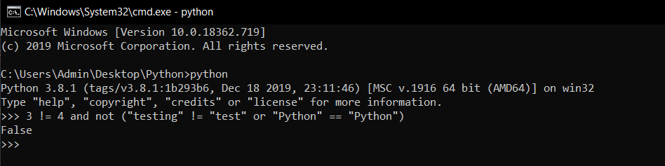

# Boolean trong python #

Những tổ hợp logic mà bạn được học trong bài trước được gọi là các biểu thức Boolean.

Boolean được sử dụng mọi nơi trong lập trình, chúng là phần thiết yếu nhất trong những chương trình.

Trong bài hôm nay bạn sẽ thực hành các bài tập về logic mà bạn đã được học trong bài hôm trước. Việc của bạn là trả lời đúng hoặc sai, thêm nữa hãy sử dụng print để in ra câu hỏi và câu trả lời của bạn.

1. True and True
2. False and True
3. 1 == 1 and 2 == 1
4. "test" == "test"
5. 1 == 1 or 2 != 1
6. True and 1 == 1
7. False and 0 != 0
8. True or 1 == 1
9. "test" == "testing"
10. 1 != 0 and 2 == 1
11. "test" != "testing"
12. "test" == 1
13. not (True and False)
14. not (1 == 1 and 0 != 1)
15. not (10 == 1 or 1000 == 1000)
16. not (1 != 10 or 3 == 4)
17. not ("testing" == "testing" and "Zed" == "Cool Guy")
18. 1 == 1 and not ("testing" == 1 or 1 == 0)
19. "chunky" == "bacon" and not (3 == 4 or 3 == 3)
20. 3 == 3 and not ("testing" == "testing" or "Python" == "Fun")

Tôi cũng chỉ cho bạn một vài mẹo để có thể làm được những bài tập phức tạp:

- Hãy tìm những biểu thức có ký tự "!=" và "==" và giải quyết nó trước, rồi thay thế biểu thức đó bằng kết quả vừa tính được.

- Tiếp theo, hãy tìm những biểu thức and và or ở trong ngoặc và làm giống như "!=" và "==".

- Tiếp theo là "not"

- Bây giờ hãy giải quyết nốt những biểu thức chứa and và or còn lại.

Tôi sẽ lấy một ví dụ để minh họa:

```Python
3 != 4 and not ("testing" != "test" or "Python" == "Python")
```

- Đầu tiên hãy bắt đầu với 3 != 4, "testing" != "test", và "Python" == "Python", ta dễ dàng tính được:
  * 3 != 4 là True
  * "testing" != "test" là True
  * "Python" == "Python" cũng là True

Thay kết quả vào ta được biểu thức:

```python
  True and not (True or True)
```

- Tiếp đến ta sẽ tính (true or true), và dĩ nhiên kết quả là True.

- Sau đó ta có not(True or True) sẽ là not(True) như ta vừa tính được và kết quả là False.

- Cuối cùng True and False là False.

Vậy kết quả cuối cùng là : False.

Bạn cũng có thể kiểm tra kết quả bằng Command Prompt như sau:



Và giờ thì luyện tập thôi nào.

### Thắc mắc bạn đọc ###

**1. Có thể sử dụng <> thay cho != không?**

  Python không hỗ trợ <>, mà nó ưu tiên sử dụng != vậy nên bạn vẫn nên sử dụng !=.

**2. Tại sao "test" and "test" trả "test", hay 1 and 1 trả về 1 mà không phải là True?**

  Trong python và nhiều ngôn ngữ khác sẽ trả về một trong hai toán tử của biểu thức Boolean chứ khoogn chỉ là True, hoặc Flse.

  
