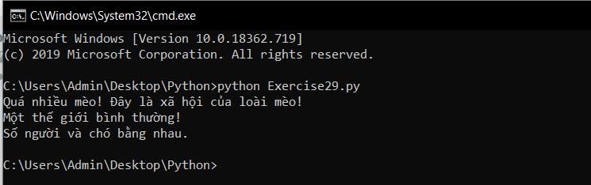

# Câu lệnh If trong python #

Đây sẽ là câu lệnh tiếp theo mà chúng ta sẽ học sau những câu lệnh như print() trước đó. Bài hôm nay chúng ta sẽ giới thiệu qua câu lệnh này.

Dưới đây là một ví dụ về việc sử dụng câu lệnh if:

```python
people = 20
cats = 30
dogs = 15
if people < cats:
  print ("Quá nhiều mèo! Đây là xã hội của loài mèo!")
if people > cats:
  print ("Mèo không nhiều lắm! Chúng chỉ đơn giản là thú nuôi!")
if people < dogs:
  print ("Thế giới của loài chó!")
if people > dogs:
  print ("Một thế giới bình thường!")
dogs += 5
if people > dogs: print ("Số người lớn hơn số cá thể chó.")
if people < dogs:
  print ("Số người nhỏ hơn số cá thể chó.")
if people == dogs:
  print ("Số người và chó bằng nhau.")
```

Kết quả thực hiện chương trình:



Thử đoán xem tác dụng của câu lệnh "if" là gì? Hãy cố gắng để trả lời câu hỏi đó nhé.


### Thắc mắc bạn đọc ###

**1. Ký hiệu "+=" là ký hiệu gì?**

  Đây không phải ký hiệu, đó là một toán tử. Nó có chức năng cộng thêm giá trị của vế phải vào vế trái.
  Ví dụ x += 3 sẽ tương tự với x = x + 3.
