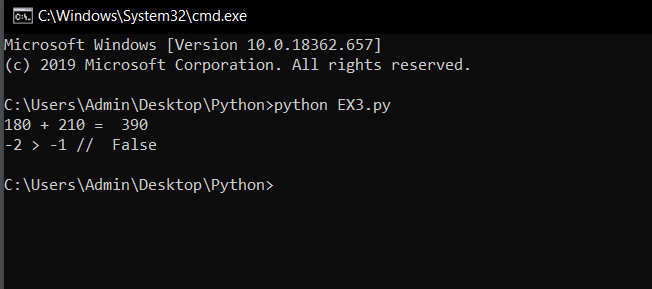

# Toán tử và số học trong python #

Mỗi ngôn ngữ lập trình đều phải có những toán tử riêng của mình, bài hôm nay chúng ta sẽ tìm hiểu sơ qua về hai trong số những toán tử của python đó là toán tử số học và toasntuwr quan hệ.
Hầu hết toán tử số học của các ngôn ngữ lập trình đều giống nhau. Ở đây mình ví dụ a = 3, b = 5

1. Toán tử số học

|Toán tử    |Ví dụ      |Chú Thích   |
|:---------:|:---------:|:----------:|
|+          |a + b = 8  |Phép cộng   |
|-          |a - b = -2 |Phép trừ    |
|*          |a * b = 15 |Phép nhân   |
|/          |a / b = 0  |Phép chia   |
|%          |a % b = 3  |Phép lấy dư |

2. Toán tử quan hệ

|Toán tử    |Ví dụ      |Chú Thích   |
|:---------:|:---------:|:----------:|
|>          |a > b  false|Phép lớn hơn, nếu đối số 1 lớn hơn đối số 2 thì kết quả sẽ trả về là True và ngược lại sẽ là False.|
|<          |a < b  true|Phép nhỏ hơn, nếu đối số 1 nhỏ hơn đối số 2 thì kết quả sẽ trả về là True và ngược lại sẽ là False.|
|>=         |a >= b  fasle|Phép lớn hơn hoặc bằng, nếu đối số 1 lớn hơn hoặc bằng đối số 2 thì kết quả sẽ trả về là True và ngược lại sẽ là False.|
|<=         |a <= b  true|Phép nhỏ hơn hoặc bằng, nếu đối số 1 nhỏ hơn hoặc bằng đối số 2 thì kết quả sẽ trả về là True và ngược lại sẽ là False.|
|==         |a == b  false|So sánh giá trị của các đối số xem có bằng nhau hay không.Nếu bằng nhau thì kết quả trả về sẽ là True và ngược lại sẽ là False.|
|!=         |a != b  true|So sánh giá trị của các đối số xem có khác nhau hay không.Nếu khác nhau thì kết quả trả về sẽ là True và ngược lại sẽ là False.|

>Dưới đây là 1 đoạn code ví dụ áp dụng các toán tử

```python
  #Tính tổng của 180 và 220
  print("180 + 210 = ", 180 + 210)
  #So sánh 2 số
  print("-2 > -1 // ",-2 > -1)
```
>Kết quả chương trình:



 ### Những điều bạn đọc thắc mắc ###

**1. Tại sao ký tự % là "Phép chia lấy dư" chứ không phải "Phần trăm"**

Điều này là do người thiết kế ngôn ngữ này quy định. Trong văn bản bình thường ký tự % là "phần trăm", như trong "100%" là "một trăm phần trăm". Trong lập trình, ký hiệu % là thể hiện của phép chia lấy dư.

**2. Phép toán % "Phép chia lấy dư" hoạt động như thế nào?**

Phép chia lấy dư "%" là cách khác để nói "a  chia cho b còn lại ". Như trong ví dụ "5 chia cho 2 còn lại 1(5 % 2 = 1)" .

**3. Thứ tự thực hiện các phép toán là gì?**
Ở Mỹ, người ta sử dụng 1 từ viết tắt là PEMDAS, là chữ viết tắt của Parentheses - ngoặc đơn, Exponents - số mũ, Multiplication - phép nhân, Divison - phép chia, Addition - phép cộng, Subtraction - phép trừ. Nó giống với ưu tiên thực hiện phép toán trong toán học.

**4. Tại sao phép chia (/) lại làm tròn xuống?**
Phép chia (/) là phép chia lấy phần nguyên vậy lên kết quả sẽ bị làm tròn xuống .
