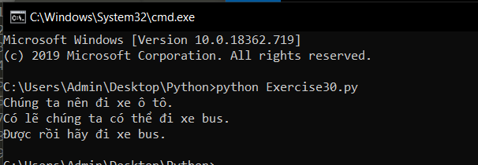

# If và Else trong python #

Bài hôm trước chúng ta đã làm quen với câu lệnh if trong python, nếu bạn tìm hiểu kỹ thì có thể biết câu lệnh if có 2 dạng:

- Dạng thiếu: là dạng mà bài trươc chúng ta lấy vị dụ, nó chỉ có một vế if.
- Dạng đầy đủ: là dạng có đầy đủ 2 vế if và else mà chúng ta sẽ tìm hiểu hôm nay.

Trước khi bắt đầu bài học hôm nay, chúng ta sẽ giải thích về câu lệnh if mà tôi đã yêu cầu các bạn tìm hiểu trong bài trước.

Nếu đã từng học ngôn ngữ lập trình khác hẳn bạn đã biết công dụng của lệnh này, nhưng trong ngôn ngữ lập trình Python nó có thêm một số đặc điểm khá thú vị.

Cấu trúc lệnh if trong Python:

```Python
if Điều kiện :
    Khối lệnh
```

Ở đây, chương trình đánh giá điều kiện và sẽ thực hiện các lệnh khi điều kiện là True. Nếu điều kiện False thì lệnh sẽ không được thực hiện.

Trong Python, khối lệnh của lệnh if được viết thụt lề vào trong. Khối lệnh của if bắt đầu với một khoảng thụt lề và dòng không thụt lề đầu tiên sẽ được hiểu là kết thúc lệnh if.

Thử xem những gì mà tôi giải thích có giống những gì mà bạn tìm hiểu được không.

Bài hôm nay chúng ta sẽ học về if - else và cũng giống như bài trước hãy xem ví dụ và tự tìm hiểu về nó:

```Python
people = 30
cars = 40
buses = 15
if cars > people:
  print ("Chúng ta nên đi xe ô tô.")
elif cars < people:
  print ("Chúng ta không nên đi xe.")
else:
  print ("Chúng ta không thể đưa ra quyết định.")
if buses > cars:
  print ("Thật nhiều xe bus.")
elif buses < cars:
  print ("Có lẽ chúng ta có thể đi xe bus.")
else:
  print ("Chúng ta vẫn không thể quyết định.")
if people > buses:
  print ("Được rồi hãy đi xe bus.")
else:
  print ("Ổn thôi, vậy chúng ta ở nhà.")
```

Kết quả thực hiện chương trình:




### Thắc mắc bạn đọc ###

**1. Điều gì sẽ sảy ra nếu kết quả của nhiều câu lệnh elif là true?**

  Python sẽ bắt đầu xử lý ở trên cùng và chạy câu lệnh đầu tiên có kết quả là true mà nó gặp được trước.
