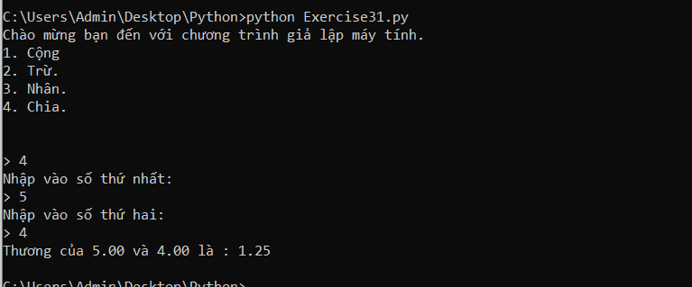

# Tạo ra một Menu trong python #

Trong nửa đầu của cuốn sách bạn chủ yếu in ra một thứ gì đó, hoặc thực hiện một chức năng nào đó. Nhưng những chức năng đó là cố định, mặc định người dùng phải sử dụng. Bây giờ với những gì đã học được về if, else và elif bạn hoàn toàn có thể tạo ra một danh sách cách chức năng(Menu) và để cho người dùng tự chọn, và từ lựa chọn đó hãy phục vụ chức năng phù hợp.

Bài hôm nay chúng ta sẽ tạo ra một menu như thế, bằng cách hỏi người dùng một số câu hỏi và đưa ra quyết định bằng câu trả lời của họ.

Dưới đây là một ví dụ minh họa về Menu trong python:

```python

def tinh_tong():
  print("Nhập vào số thứ nhất: ")
  a = float(input("> "))
  print("Nhập vào số thứ hai: ")
  b = float(input("> "))
  print("Tổng của %0.2f và %0.2f là : %0.2f" %(a,b,a+b))

def tinh_hieu():
  print("Nhập vào số thứ nhất: ")
  a = float(input("> "))
  print("Nhập vào số thứ hai: ")
  b = float(input("> "))
  print("Hiệu của %0.2f và %0.2f là : %0.2f" %(a,b,a-b))

def tinh_tich():
  print("Nhập vào số thứ nhất: ")
  a = float(input("> "))
  print("Nhập vào số thứ hai: ")
  b = float(input("> "))
  print("Tích của %0.2f và %0.2f là : %0.2f" %(a,b,a*b))

def tinh_thuong():
  print("Nhập vào số thứ nhất: ")
  a = float(input("> "))
  print("Nhập vào số thứ hai: ")
  b = float(input("> "))
  print("Thương của %0.2f và %0.2f là : %0.2f" %(a,b,a/b))

print("Chào mừng bạn đến với chương trình giả lập máy tính.")
display = """1. Cộng
2. Trừ.
3. Nhân.
4. Chia.\n
"""
print(display)
option = input("> ")
if option == "1" :
  tinh_tong()
elif option == "2" :
  tinh_hieu()
elif option == "3" :
  tinh_tich()
elif option == "4" :
  tinh_thuong()
else :
  print("Không có lựa chọn này.")

```

Kết quả của chương trình sẽ như sau:



Hãy tự tạo ra một Menu của bạn nhé.

### Thắc mắc bạn đọc ###

**1. Tôi có thể thay thế elif bằng một tổ hợp if và else không?**

  Trong một vài trường hợp thì bạn hoàn toàn có thể thay đổi chũng, nhưng nếu không cẩn thận bạn có thể sẽ làm cho máy tính hiểu sai điều bạn muốn.

**2. Làm như thế nào để tôi có thể diễn tả một số nằm ở trong phạm vi giữa hai số?**

  Giả sử bạn muốn biểu đạt x nằm trong khoảng (0,10) thì đơn giản bạn chỉ phải viết 0 < x < 10.
