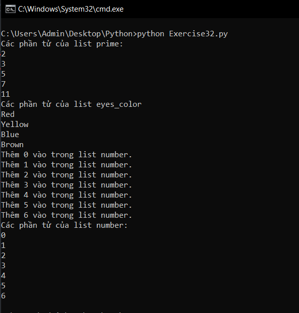

# Lặp và danh sách trong python #

Hiện tại với nhũng gì đã học được, bạn hoàn toàn có thể làm cho 1 chương trình trở nên thú vị. Với if, else và elif bạn cũng có thể làm cho chương trình của mình thông minh hơn. Tuy nhiên các chương trình sau này bạn làm sẽ phải xử lý những công việc lặp đi lặp lại, vì thế nếu muốn nó hoàn hảo hơn bạn phải học cách sử dụng vòng lặp.

Trước khi học cách sử dụng vòng lặp chúng ta cần một danh sách để lưu kết quả của vòng lặp, vậy nên trước hết hãy cùng tìm hiểu về danh sách.

Cú pháp tạo ra một danh sách trong python như sau:

```python
#<Tên_danh_sach>  = [phần_tử_1, phần_tử_2,...]
#Ví dụ
prime = [2,3,5,7,11]
eyes_color = ['Red','Yellow','Blue','Brown']
```

Bây giờ hãy sử dụng vòng lặp và in ra các phần tử của danh sách.

```python

#<Tên_danh_sach>  = [phần_tử_1, phần_tử_2,...]
#Ví dụ
prime = [2,3,5,7,11]
eyes_color = ['Red','Yellow','Blue','Brown']
# Đây là loại vòng lặp đi qua toàn bộ phần tử của danh sách
print("Các phần tử của list prime:")
for i in prime:
  print(i)
print("Các phần tử của list eyes_color:")
for j in eyes_color:
  print(j)
# Vậy làm như thế nào để lưu kết quả của vòng lặp
#Trước hết hãy tạo ra một danh sách rỗng
number = []
#Tiếp theo với mỗi vòng hãy lưu giá trị vào danh sách đó bằng câu lệnh append() như sau
for i in range(0,7):
  #Chạy từ 0 đến 6
  print("Thêm %d vào trong list number." %i)
  number.append(i)
# Bây giờ hãy thử in ra list vừa lưu kết quả
print("Các phần tử của list number:")
for j in number:
  print(j)
```

Kết quả sẽ trông như thế này:



Qua bài hôm nay các bạn đã học được cách sử dụng list và for trong python, hy vọng nó sẽ giúp cho chương trình của bạn hoàn hảo hơn.

### Thắc mắc bạn đọc ###

**1. Làm như thế nào để tôi có thể tạo một danh sách 2 chiều?**

  Đơn giản hãy tạo một danh sách bên trong một danh sách. Ví dụ bạn cần tạo ra một danh sách gồm 3 dòng như sau:

  |1|2|3|
  |:-:|:-:|:-:|
  | **4** | **5** | **6** |
  | **7** | **8** | **9** |

  Thì bạn chỉ việc khai báo:

  ```python
  list = [[1,2,3][4,5,6][7,8,9]]
  ```
  Đơn giản đúng không nào.

**2. Mảng và danh sách là giống nhau phải không?**

  Trong ngôn ngữ cổ thì mảng và danh sách rất khác nhau vì cách chúng được thực hiện. Còn trong lập trình nó phụ thuộc vào cách thực hiện và ngôn ngưc, dù sao bạn chỉ cần biết trong python người ta gọi đó là danh sách.

**3. Tại sao vòng lặp for có thể sử dụng được các biến chưa được khai báo?**

    Thực ra mỗi lẫn chạy 1 vòng nó sẽ tạo ra 1 biến có tên như vậy và khởi tạo thành phần tử hiện tại của danh sách đang được xét đến.
