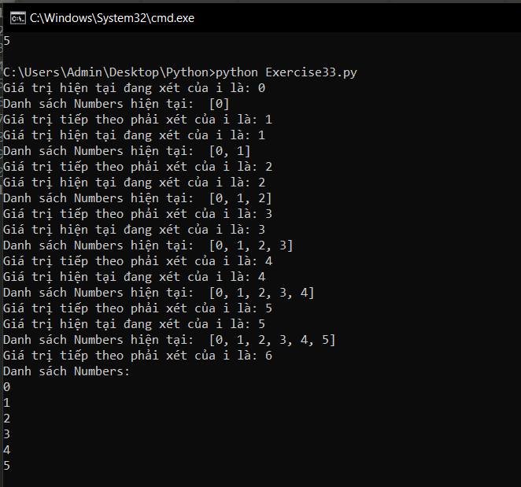

# Vòng lặp While trong python #

Vòng lặp được sử dụng trong lập trình để lặp lại một đoạn code cụ thể, while cũng là một trong số đó. Trong Python, while được dùng để lặp lại một khối lệnh, đoạn code khi điều kiện kiểm tra là đúng. while dùng trong những trường hợp mà chúng ta không thể dự đoán trước được số lần cần lặp là bao nhiêu.

Cú pháp của vòng lặp while trong python:

```Python
while điều_kiện_kiểm_tra :
  Khối lệnh của while
```

Ví dụ về việc sử dụng vòng lặp while:

```Python
i = 0
numbers = []
while i < 6:
   print ("Giá trị hiện tại đang xét của i là: %d" % i)
   numbers.append(i)
   i = i + 1
   print ("Danh sách Numbers hiện tại: ", numbers)
   print ("Giá trị tiếp theo phải xét của i là: %d" % i)
print ("Danh sách Numbers: ")
for num in numbers:
  print (num)
```

Kết quá của chương trình:



Vấn đề đối với vòng lặp while là đôi khi chúng không dừng lại được dẫn đến chương trình chạy không có điểm dừng. Để tránh trường hợp đó sảy ra thì có 3 quy tắc mà bạn phải tuân theo:

- Hãy chắc rằng bạn sử dụng vòng lặp while một cách hợp lý, thông thường vòng lặp for sẽ là ưu tiên hơn.

- Xem lại điều kiện lặp lại của while, chắc rằng nó sẽ sai tại một vài trường hợp.

- Khi bạn nghi ngờ vòng lặp while của bạn là vô hạn hãy in ra biến kiểm tra ở đầu và cuối vòng while để xem nó đang làm gì.

### Thắc mắc bạn đọc ###

**1. Trong ví dụ của bài trước từ khóa "range" có nghĩa là gì?**

  Bạn có thể sử dụng hàm range() để tạo ra một dãy số. Ví dụ, range(100) sẽ tạo một dãy số từ 0 đến 99 (100 số).

  Hàm range(số bắt đầu, số kết thúc, khoảng cách giữa hai số) được sử dụng để tạo dãy số tùy chỉnh. Nếu không đặt khoảng cách giữa hai số thì Python sẽ hiểu mặc định nó bằng 1.

  Hàm range() không lưu tất cả các giá trị trong bộ nhớ mà nó lưu giá trị bắt đầu, giá trị kết thúc và khoảng cách giữa hai số từ đó tạo ra số tiếp theo trong dãy.

**2. Sự khác biệt vòng lặp for và while là gì ?**

  Vòng lặp for chỉ có thể lặp trên một danh sách nào đó, còn while có thể lặp theo bất kì kiểu lặp nào bạn muốn. Tuy nhiên vòng lặp for được ưu tiên sử dụng hơn.
  
