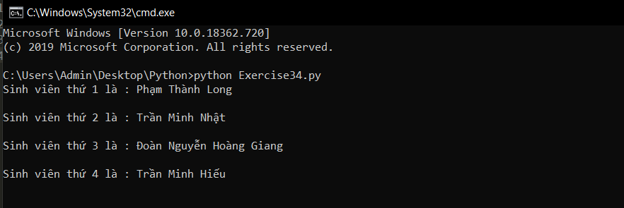

# Truy cập đến các phần tử của một danh sách #

Danh sách khá là hữu ích, nhưng nếu bạn không thể truy cập đến các phần tử trong nó thì chúng cũng không tốt lắm. Vì thế bài hôm nay chúng ta sẽ học cách truy cập đến các phần tử trong một danh sách.

Ví dụ có danh sách:

```python
animals = ['bear', 'tiger', 'zebra', 'cat']
```
Bây giờ bạn muốn truy cập đến phần tử đầu tiên của danh sách này thì phải làm thế nào?

Bạn chỉ việc gõ **animals[0]** và ở đây **animals[0] = 'bear'**.

Vậy làm thế nào để truy cập đến phần tử ngẫu nhiên thứ n?

Với phần tử ngẫu nhiên thứ n chúng ta cũng làm tương tự, nhưng hãy nhớ rằng **trong lập trình số 0 là số đầu tiên** vì vậy phần tử thứ n trong danh sách là: **Tên_danh_sách[n-1]**.

Thử áp dụng điều vừa học được nhé:

```python
students = ["Phạm Thành Long", "Trần Minh Nhật", "Đoàn Nguyễn Hoàng Giang", "Trần Minh Hiếu", "Nguyễn Huy Hoàng"]

for i in range(4):
  print("Sinh viên thứ %d là : %s\n" %(i+1, students[i]))
```

Chương trình có kết quả như sau:




### Thắc mắc bạn đọc ###

**1. Tại sao for i in range(1, 3) lại chỉ lặp 2 lần thay vì 3 lần ?**

  Bởi vì range(1, 3) tạo ra dãy [1,2] vậy nên nó chỉ lặp 2 lần.
