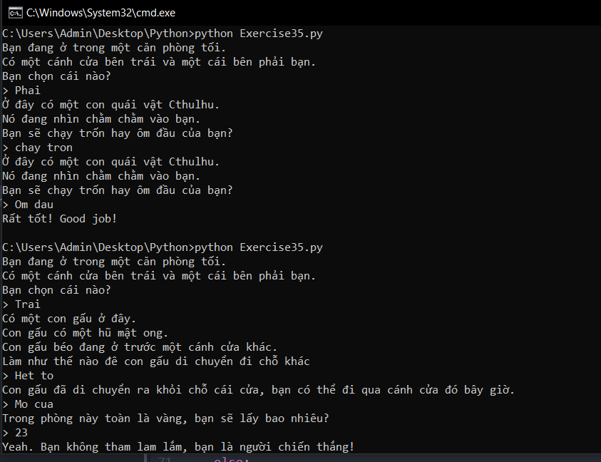

# Phân nhánh và hàm trong python #

Bạn đã học qua hàm, câu lệnh rẽ nhánh if, else, elif và danh sách. Bài hôm nay chúng ta sẽ kết hợp chúng lại để tạo ra một chương trình hoàn thiện.

Ví dụ:

```python
from sys import exit
def gold_room():
   print ("Trong phòng này toàn là vàng, bạn sẽ lấy bao nhiêu?")
   next = input("> ")
   if next.isdigit():
     how_much = int(next)
   else:
     dead("Hãy học cách gõ một số.")
   if how_much < 50:
     print ("Yeah. Bạn không tham lam lắm, bạn là người chiến thắng!")
     exit(0)
   else:
     dead("Bà thật là tham lam!")

def bear_room():
   print ("Có một con gấu ở đây.")
   print ("Con gấu có một hũ mật ong.")
   print ("Con gấu béo đang ở trước một cánh cửa khác.")
   print ("Làm như thế nào đê con gấu di chuyển đi chỗ khác")
   bear_moved = False
   while True:
      next = input("> ")
      if next == "Lay mat ong":
        dead("Con gấu sẽ nhìn chằm chằm vào bạn, sau đó nó tấn công bạn.")

      elif next == "Het to" and not bear_moved:
        print ("Con gấu đã di chuyển ra khỏi chỗ cái cửa, bạn có thể đi qua cánh cửa đó bây giờ.")
        bear_moved = True

      elif next == "Het to" and bear_moved:
        dead("Con gấu bị chọc giận và nó sẽ tấn công bạn.")

      elif next == "Mo cua" and bear_moved:
        gold_room()

      else:
        print ("Tôi không biết điều đó nghĩa là gì.")

def cthulhu_room():
   print ("Ở đây có một con quái vật Cthulhu.")
   print ("Nó đang nhìn chằm chằm vào bạn.")
   print ("Bạn sẽ chạy trốn hay ôm đầu của bạn?")
   next = input("> ")
   if "Chay tron" in next:
     start()
   elif "Om dau" in next:
     dead("Rất tốt!")
   else:
     cthulhu_room()

def dead(why):
  print (why, "Good job!")
  exit(0)

def start():
   print ("Bạn đang ở trong một căn phòng tối.")
   print ("Có một cánh cửa bên trái và một cái bên phải bạn.")
   print ("Bạn chọn cái nào?")
   next = input("> ")
   if next == "Trai":
     bear_room()
   elif next == "Phai":
     cthulhu_room()
   else:
     dead("Bạn bị nhốt trong phòng cho đến khi bị chết đói.")
start()
```
Kết quả thực thi chương trình:



### Thắc mắc bạn đọc ###

**1. Tại sao lại là while true: ?**

  Để tạo ra một vòng lặp vô hạn

**2. Hàm Exit(0) có chức năng gì?**

  Trên nhiều hệ điều hành, exit(0) giúp chúng ta dừng chương trình lại và trả về 0 nếu nó hoạt động bình thường, trả về một số khác không nếu nó có lỗi nào đó.
