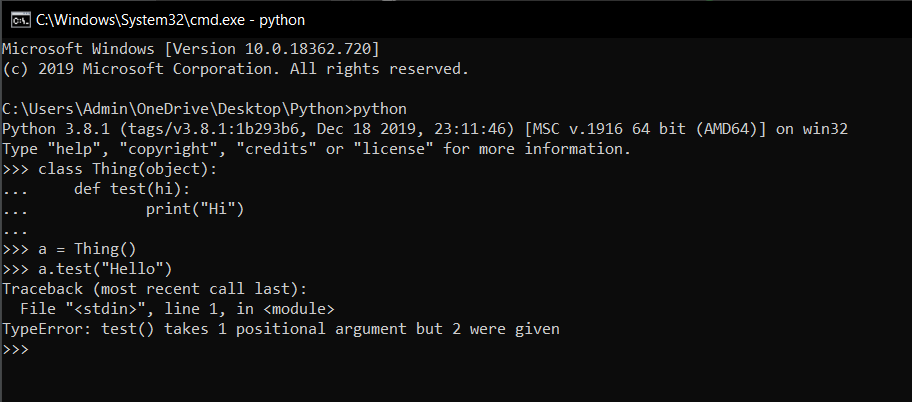
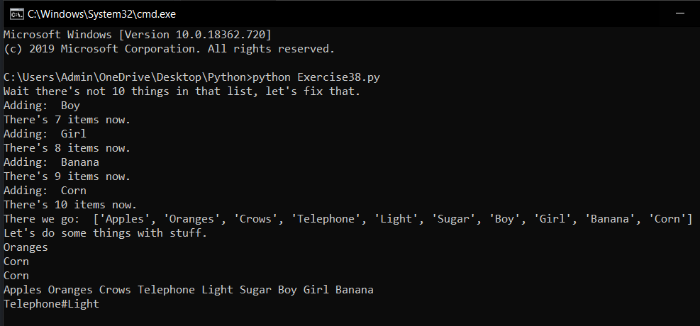

# Làm việc với Lists #

Bạn đã học qua về Lists, và khi học vòng lặp while bạn cũng đã làm việc với Lists thông qua hàm append() để thêm một phần tử vào cuối Lists. Bài hôm nay chúng ta sẽ học thêm những hàm làm việc với Lists trong python.

Trước khi vào bài học chúng tôi sẽ nói với bạn một vài điều về cách hoạt động của python khi bạn nhập **mystuff.append('hello')**.

1. Trước tiên python thấy bạn đề cập đến mystuff và nó sẽ tìm kiếm biến đó.

2. Sau khi tìm kiếm, khi bạn nhấn toán tử '.' nó sẽ xuất hiện các chức năng mà mystuff sở hữu.

3. Sau đó nó sẽ tìm kiếm "append" trong tất cả các chức năng mà nó sở hữu, nếu "append" có trong số đó thì nó sẽ lấy ra và sử dụng.

4. Tiếp theo khi bạn nhập (), python nhận ra đây là dấu hiệu của hàm, lúc này thay vì chạy bình thường nó sẽ chạy hàm với một đối số phu.

5. Đối số được thêm vào ở đây là "mystuff". Lạ nhỉ, nhưng đó là cách mà python hoạt động, và việc của bạn là ghi nhớ chúng. Những điều sảy ra sau đó là python sẽ gọi hàm append(mystuff, 'hello') thay vì mystuff.append('hello') mà bạn nhập.

Đối với phần lớn các bạn không cần phải biết điều này, nhưng nó sẽ giúp ích khi bạn nhận được một thông báo lỗi từ python kiểu như thế này:



Như bạn thấy đấy python nói hàm test() có 2 đối số nhưng bạn chỉ nhập vào một đối số, điều này có nghĩa là python đã thay đổi test("Hello") thành test(a,"Hello")

Hi vọng những điều trên sẽ làm bạn hiểu thêm về cách hoạt động của python. Rồi quây trở lại bài học hôm nay. Chúng ta có một bài tập như sau:

```python
things = "Apples Oranges Crows Telephone Light Sugar"
print ("Wait there's not 10 things in that list, let's fix that.")
stuff = things.split(' ')
more_stuff = ["Day", "Night", "Song", "Frisbee", "Corn", "Banana", "Girl", "Boy"]
while len(stuff) != 10:
   next_one = more_stuff.pop()
   print ("Adding: ", next_one)
   stuff.append(next_one)
   print ("There's %d items now." % len(stuff))
print ("There we go: ", stuff)
print ("Let's do some things with stuff.")
print (stuff[1])
print (stuff[-1]) # whoa! fancy
print (stuff.pop())
print (' '.join(stuff)) # what? cool!
print ('#'.join(stuff[3:5])) # super stellar!
```

Và đây là kết quả khi chạy chương trình:



Bạn thấy chương trình này có gì mới mẻ không, hãy tự tìm hiểu nhé.


### Thắc mắc bạn đọc ###

**1. Chẳng phải bạn nói không bao giờ sử dụng vòng lặp while sao?**

  Vâng, chính tôi đã nói như vậy, bạn chỉ cần nhớ bạn có thể phá vỡ quy tắc nếu như lý do của bạn tốt.

**2. Câu lệnh join(stuff[3:5]) có tác dụng gì ?**

    Nó chỉ định phạm vi hoạt động của hàm join() là từ phần tử thứ 3 đến phần tử thứ 4 của stuff.
