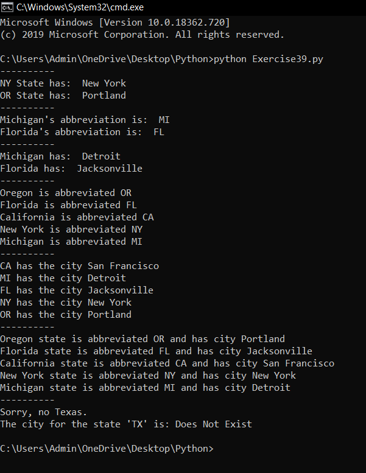

# Thư viện (Dict) trong python #

Bài hôm nay tôi sẽ giới thiệu với bạn một container mới trong python, một container mà khi bạn nghiên cứu về nó bạn sẽ thấy nó thật hữu ích. Đó chính là dictionary.

python gọi nó là "dict", các ngôn ngữ khác thì gọi là "hashes". Tôi có xu hướng dùng cả hai tên này, điều này không quan trọng, điều quan trọng là so sánh với lists thì nó làm được gì?

Bạn thấy đấy lists cho phép chúng ta làm điều này:

```python
>>> things = ['a', 'b', 'c', 'd']
>>> print (things[1])
b
>>> things[1] = 'z'
>>> print (things[1])
z
>>> print (things)
['a', 'z', 'c', 'd']
>>>
```

Bạn có thể sử dụng số để làm chỉ số cho danh sách, nghãi là bạn có thể sử dụng số để tìm hiểu những gì có trong lists. Nhưng lists chỉ cho phép chúng ta sử dụng số để làm điều đó.

Những gì một dict làm đó là bạn sử dụng bất cứ điều gì, không chỉ là số để làm điều đó:

```python
>>> stuff = {'name': 'Zed', 'age': 36, 'height': 6*12+2}
>>> print (stuff['name'])
Zed
>>> print (stuff['age'])
36
>>> print (stuff['height'])
74
>>> stuff['city'] = "San Francisco"
>>> print (stuff['city'])
San Francisco
>>>
```

Như bạn thấy ở đây, thay vì những cón số chúng ta có thể dùng chuỗi để tìm những gì mà chúng ta muốn trong từ điển. Chúng ta cũng có thể đưa những thông tin mới vào dict thông qua một chuỗi, hoặc không phải là chuỗi:

```python
>>> stuff[1] = "Wow"
>>> stuff[2] = "Neato"
>>> print (stuff[1])
Wow
>>> print (stuff[2])
Neato
>>> print (stuff)
{'city': 'San Francisco', 2: 'Neato',
'name': 'Zed', 1: 'Wow', 'age': 36,
'height': 74}
>>>
```
Trong ví dụ này tôi sử dụng một số để làm điều đó, và như bạn thấy khi tôi in nó ra thì các số này ở dạng key.

Tất nhiên, nếu chỉ cho phép thêm mới thì dict khá là vô dụng, vì vậy dict cũng cho pháp bạn xóa mọi thứ mà nó có bằng từ khóa:

```python
>>> del stuff['city']
>>> del stuff[1]
>>> del stuff[2]
>>> stuff
{'name': 'Zed', 'age': 36, 'height': 74}
>>>
```

Bây giờ chúng ta sẽ đến với một bài tập về dict:

```python
# Tạo ra một dict lưu tên viết tắt của những bang của Mỹ
states = {
 'Oregon': 'OR',
 'Florida': 'FL',
 'California': 'CA',
 'New York': 'NY',
 'Michigan': 'MI'
}
# Tạo ra một dict lưu các thủ đô của các bang của Mỹ
cities = {
 'CA': 'San Francisco',
 'MI': 'Detroit',
 'FL': 'Jacksonville'
}
# Thêm một vài thủ đô vào dict cities
cities['NY'] = 'New York'
cities['OR'] = 'Portland'
# in ra một vài thủ đô
print ('-' * 10)
print ("NY State has: ", cities['NY'])
print ("OR State has: ", cities['OR'])
# in ra một vào bang
print ('-' * 10)
print ("Michigan's abbreviation is: ", states['Michigan'])
print ("Florida's abbreviation is: ", states['Florida'])
# Làm 2 điều trên bằng cách sử dụng dict states sau đó là dict cities
print ('-' * 10)
print ("Michigan has: ", cities[states['Michigan']])
print ("Florida has: ", cities[states['Florida']])
# In ra tất cả các bang
print ('-' * 10)
for state, abbrev in states.items():
  print ("%s is abbreviated %s" % (state, abbrev))
# In ra tất cả các thủ đô của các bang
print ('-' * 10)
for abbrev, city in cities.items():
  print ("%s has the city %s" % (abbrev, city))
#Bây giờ làm cả 2 điều trên trong cùng một lúc
print ('-' * 10)
for state, abbrev in states.items():
   print ("%s state is abbreviated %s and has city %s" % (
   state, abbrev, cities[abbrev]))
print ('-' * 10)
# Cách an toàn để lấy ra một state nếu không chắc nó có xuất hiện trong dict states
state = states.get('Texas', None)
if not state:
  print ("Sorry, no Texas.")
# Lấy ra một city với một giá trị mặc định
city = cities.get('TX', 'Does Not Exist')
print ("The city for the state 'TX' is: %s" % city)
```

Đây là kết quả khi chạy chương trình:



Hãy cố tìm hiểu xem chúng tôi đã làm gì nhé.

### Thắc mắc bạn đọc ###

**1. Sự kahcs biệt giữa Lists và Dict là gì?**

  List chứa một tập các giá trị, được phân tách nhau bằng dấu phẩy, List có thể chứa bất kỳ kiểu dữ liệu nào.

  Kacs với Lists, Dict lưu trữ các phần tử theo dạng {key: value}, các key phải có giá trị khác nhau và Python chỉ chấp nhận các key có các kiểu dữ liệu như (string, number, tuple).

**2. Tôi sẽ sử dụng Dict trong trường hợp nào?**

  Bất cứ khi nào bạn cần phải tra cứu, tìm kiếm thông tin từ một giá trị khác hay là key.

**3. Vậy khi nào thì sử dụng Lists?**

  Sử dụng Lists khi bạn phải lưu trữ thông tin theo thứ tự, và khi tìm kiếm thì yêu cầu tìm kiếm thông qua số.

**4. Vậy nếu tôi cần một Dict lưu trữ theo thứ tự thì sao?**

  Hãy tìm hiểu về Ordered Dict trong python, có lẽ nó sẽ giúp ích cho bạn.
