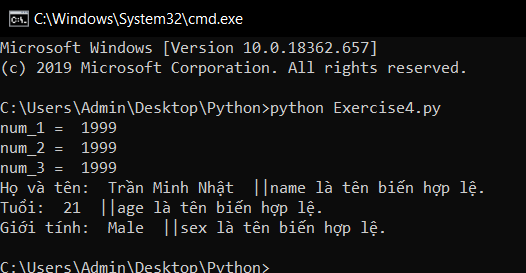

# Cơ bản về biến, tên biến trong python #
  *Với câu lệnh print, bây giờ bạn đã có thể in ra màn hình 1 chuỗi, 1 biểu thức toán học. Bài học hôm nay chúng ta sẽ học về biến, tên biến trong trong python.*

  *Nếu các bạn có nhớ qua thuật ngữ biến số trong Toán học nghĩa là một số có thể bị thay đổi, thì biến dữ liệu (variable) trong lập trình nghĩa là một giá trị dữ liệu có thể thay đổi. Thay đổi ở đây nghĩa là thay đổi bởi các tác động trong mã nguồn của bạn, ví dụ có một hàm nào đó thực thi để thay đổi giá trị của biến.*

### Khai báo biến trong python ###

Để khai báo biến trong Python thì mọi người sử dụng cú pháp:

```Python
  tienBien = giaTri
```
Trong đó:

* **tenBien** là tên của biến mà các bạn muốn đặt. Tên biến này không được bắt đầu bằng số hay các ký tự đặc biệt, mà chỉ được bắt đầu bằng chữ cái hoặc ký tự _ và nó có phân biệt hoa thường. Các lập trình viên thường đặt tên của họ bằng các từ tiếng anh gợi nhớ đến tác dụng của biến đó để cho họ tiện thao tác cũng như để người đọc dễ theo dõi hơn.
  **VD:**
  Những tên hợp lệ: *name, age, full_Name,...*
  Những tên không hợp lệ: *2_five, *, ...*

* **giaTri** là giá trị của biến mà bạn muốn gán.

**VD:** Mình sẽ khai báo một biến **name** trong Python.
```Python
  name = "Trần Minh Nhật"
```

Ngoài ra, bạn cũng có thể khai báo nhiểu biến 1 lúc.

```Python
num_1 = num_2 = num_3 = 1999
print("num_1 = ", num_1)
print("num_2 = ", num_2)
print("num_3 = ", num_3)
name, age, sex = "Trần Minh Nhật", 21, "Male"
print("Họ và tên: ", name, " ||name là tên biến hợp lệ.")
print("Tuổi: ", age, " ||age là tên biến hợp lệ.")
print("Giới tính: ", sex, " ||sex là tên biến hợp lệ.")
```

**Kết quả:**



### Thắc mắc bạn đọc ###

**1. Có thể viết "x=100" thay vì "x = 100" không?**

Tất nhiên là được rồi, nhưng bạn vẫn nên viết "x = 100" hơn, bởi vì viết như này tạo độ thoáng cho chương trình của bạn, giúp người đọc dễ theo dõi hơn.

**2. Sự khác biết giữa "=" và "==" là gì?**

Hiểu đơn giản thì "=" dùng để gán giá trị như chúng ta vừa làm, còn "==" dùng để kiểm tra xem giá trị của 2 biến có bằng nhau hay không. Vấn đề này sẽ được nói rõ hơn trong những bài sau.
