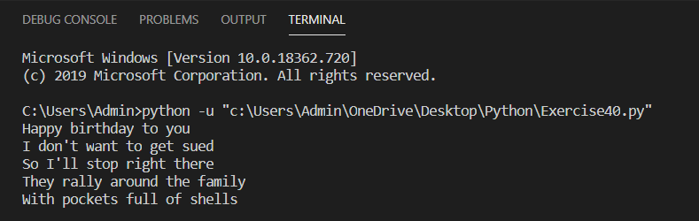

# Modules, Classes và Objects trong python #

Python là một ngôn ngữ "Lập trình hướng đối tượng". Điều này có nghĩa là có một cấu trúc cho phép Python gọi đến một class để làm cho chương trình của bạn có cấu trúc cụ thể.

Bằng cách sử dụng class bạn sẽ làm chương trình của mình nhất quán hơn để làm cho nó chạy một cách rõ ràng hơn.

Bài hôm nay chúng tôi sẽ giới thiệu cơ bản nhất về lập trình hướng đối tượng trong python. Áp dụng những gì đã học về Dict tôi sẽ dạy cho bạn về Modules, Classes(các lớp) và Objects(các đối tượng).

Bắt đầu thôi:

**Modules khá giống Dict trong python**

Bạn biết cách để tạo ra và sử dụng một Dict trong python phải không nào. Giả sử bây giờ tôi có Dict "mystuff" như sau:

```Python
mystuff = {'apple': "I AM APPLES!"}
```

Bây giờ tôi muốn lấy 'apple' ra khỏi 'mystuff' thì tôi làm như sau:

```Python
mystuff = {'apple': "I AM APPLES!"}
print(mystuff['apple'])
```

Giữ nguyên ý tưởng lấy 'apple' ra khỏi 'mystuff', bây giờ hãy nghĩ về cách sử dụng Modules:

1. Một file Python chứa một số phương thức, biến.
2. Muốn sử dụng nó phải import file đó.
3. Dùng các phương thức, các biến trong file đó bằng cách sử dụng toán tử ".".

Nếu bạn để ý thì từ trước đến nay bạn đã sử dụng một vài Modules như file.read(), file.write()...

Bây giờ hãy áp dụng nó để thực hiện ý tưởng vừa rồi:

Trước hết ta tạo một file python có tên là mystuff.py như sau:

```Python
def apple():
  print("I AM APPLES!")
```

Tiếp theo ta import nó trong chương trình mà muốn dùng tới nó, để tách 'apple' ra khỏi 'mystuff' ta chỉ việc dùng toán tử "." như sau:

```Python
import mystuff
mystuff.apple()
```

Bây giờ ta thêm một biến có tên là 'tangerine' vào trong file 'mystuff':

```Python
def apple(): print "I AM APPLES!"
# Đây chỉ đơn giản là một biến
tangerine = "Living reflection of a dream"
```

Tương tự như các sử dụng hàm apple() thì để sử dụng biến 'tangerine' trong 'mystuff' ta làm tương tự:

```Python
import mystuff
mystuff.apple()
print(mystuff.tangerine)
```

So sánh với cách dùng Dict trong python với cách sử dụng Modules bạn có thể thấy 2 cách này tương tự nhau, nhưng khác nhau về cú pháp

```python
mystuff['apple']
mystuff.apple()
```

**Class trong python**

Modules cho phép lưu trữ mã python, để truy cập đến nó bạn phải import file Module và sử dụng toán tử ".". Python cũng có một cấu trúc khác phục vụ mục đích tương tự đó là Class.

Class cho phép lưu chữ các nhóm chức năng và dữ liệu, bạn có thể truy cập đến chúng bằng toán tử "." giống như Module.

Nếu tôi tạo một Class giống như Module mystuff nó sẽ trông như thế này:

```Python
class MyStuff(object):
  def __init__(self):
      self.tangerine = "And now a thousand years between"
  def apple(self):
      print "I AM CLASSY APPLES!"
```

Nếu so sánh với Module thì Class trong có vẻ phức tạp hơn, thế nhưng bạn hãy coi Class như một Module nhỏ có tên "MyStuff", chứa phương thức 'apple', phương thức khởi tạo "\_\_init\_\_" để tạo ra biến 'tangerine'.

Với các sử dụng class như thế này bạn có thể tạo ra vô số đối tượng có chức năng 'apple' và có biến 'tangerine'.

Trước hết bạn cần biết 'object' là gì?, và cách làm việc với class có gì khác với làm việc với Module.

**Object là một mini import**

Nếu như Class là một mini Module thì Object lại là một mini import. Nhưng thay vì import như Module thì khi muốn sử dụng Class bạn phải khởi tạo Object. Để khởi tạo một Object từ Class "MyStuff" ta làm như sau:

```Python
class MyStuff(object):
  def __init__(self):
    self.tangerine = "And now a thousand years between"
  def apple(self):
    print "I AM CLASSY APPLES!"
#Tạo ra một Object có tên là thing
thing = MyStuff()
thing.apple()
print (thing.tangerine)
```

Như bạn thấy thì Object được tạo ra từ một Class có đầy đủ các phương thức và các biến chức năng của Class, và để sử dụng nó thì bạn sử dụng toán tử "." như trong ví dụ.

Ở ví dụ này khi bạn nhập "thing = MyStuff()" thì python sẽ gọi đến hàm khởi tạo mà bạn đã viết trong Class MyStuff - Đó là hàm "\_\_init\_\_(self)" như bạn thấy. Khi gọi đến hàm khởi tạo này thì python sẽ khởi tạo các giá trị ban đầu của các biến chức năng như bạn đã tạo trong Class.(self.tangerine = "And now a thousand years between")

Class thực sự rất khác Module, các bạn cần nhớ lấy điều này. Hiện tại có thể bạn còn đang mông lung nhưng đừng lo, sau 1 quá trình luyện tập và coding, bạn sẽ hiểu rõ chúng thôi.

Xem qua 1 ví dụ dưới đây về cách sử dụng Class, Module và Dict nhé:

1. Sử dụng Dict:

  ```Python
  mystuff = {'apple': "I AM APPLES!"}
  print(mystuff['apple'])
  ```

2. Sử dụng Module:

  Tạo file mystuff.py

  ```Python
  def apple():
    print("I AM APPLES!")
  ```

  Import file mystuff.py

  ```Python
  import mystuff
  mystuff.apple()
  ```

3. Sử dụng Class:

  ```Python
  class MyStuff:
    def apple(self):
      print("I AM APPLES")
  thing = MyStuff()
  thing.apple()
  ```

Bây giờ hãy tự tao cho mình một Class đầu tiên nhé.

**Class đầu tiên**

```python
class Song(object):
  def __init__(self, lyrics):
    self.lyrics = lyrics
  def sing_me_a_song(self):
    for line in self.lyrics:
      print line
happy_bday = Song(["Happy birthday to you", "I don't want to get sued", "So I'll stop right there"])
bulls_on_parade = Song(["They rally around the family",
 "With pockets full of shells"])
happy_bday.sing_me_a_song()
bulls_on_parade.sing_me_a_song()
```

**Kết quả khi chạy chương trình**



### Thắc mắc bạn đọc ###

**1. Tại sao lại có tham số 'self' cho hàm khởi tạo "\_\_init\_\_"?**

  Tham số 'self' ở đây thể hiện rằng biến bạn cần khởi tạo là của Class mà bạn đang viết chứ không phải là một biến cục bộ của chương trình.
