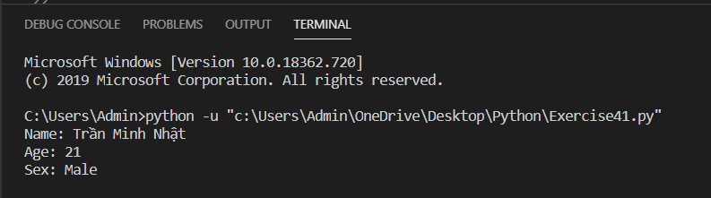

# Học cách mô tả một Class theo hướng đối tượng #

Trong bài này, tôi sẽ dạy bạn cách mô tả một Class bằng ngôn ngữ hướng đối tượng. Những gì tôi sẽ làm đó là cung cấp cho bạn một số từ khóa và nghĩa của chúng. Tiếp theo đó, tôi sẽ cung cấp cho bạn một số cấu trúc mà bạn phải tìm hiểu. Cuối cùng tôi sẽ cho bạn một ví dụ để bạn cũng cố lại những gì đã học được.

## Từ khóa ##

* **class:** Tạo mới một kiểu dữ liệu do người dùng định nghĩa.

* **object:** Có 2 nghĩa: Có thể là đối tượng cơ bản nhất của một kiểu dữ liệu, cũng có thể nói chung chung tất cả các đối tượng của một kiểu dữ liệu.

* **def:** Tạo mới một chức năng.

* **sefl:** Bên trong các chức năng của một class, sefl là thể hiện của chính đối tượng truy cập chức năng đó.

* **inheritance:** Khái niệm một class có thể thừa hưởng, kế thừa lại những chức năng của một class khác.

* **composition:** Khái niệm rằng một class có thể bao gồm nhiều class khác như các bộ phận.

* **attribute:** Một thuộc tính của class có trong class thành phần và thường là các biến.

* **is-a:** Một cụm từ để nói rằng một cái gì đó được thừa hưởng từ cái khác, như trong Cá hồi là - Cá.

* **has-a:** Một cụm từ để nói rằng một cái gì đó bao gồm những thứ khác hoặc có một đặc điểm, như trong Salmon có - một cái miệng.

Được rồi bây giờ hãy giành một chút thời gian để ghi nhớ những từ khóa cơ bản trên.

## Cấu trúc ##

**class X(Y)**
"Make a class named X that is-a Y."
"Tạo một class X được thừa hưởng từ class Y."

**class X(object): def __init__(self, J)**
"class X has-a \_\_init\_\_ that takes self and J parameters."
"Tạo một class X có chứa hàm khởi tạo \_\_init\_\_ có 2 tham số là self và J"

**class X(object): def M(self, J)**
"class X has-a function named M that takes self and J parameters."
"Tạo một class X, mà các thể hiện của X có chức năng M, M có tham số self và J"

**foo = X()**
"Set foo to an instance of class X."
"Tạo ra một thể hiện foo của class X."

**foo.M(J)**
"From foo get the M function, and call it with parameters self, J."
"Từ thể hiện foo gọi đến chức năng M với tham số đầu vào là J."

**foo.K = Q**
"From foo get the K attribute and set it to Q."
"Từ thể hiện foo truy cập đến thuộc tính K và gán nó bằng Q."

Hãy cố gắng ghi nhớ những cấu trúc này vì bạn sẽ phải sử dụng nó thường xuyên.

## Ví dụ minh họa ##

```python
class Person:
    def __init__(self, name, age):
        self.name, self.age = name, age
    def getName(self):
        print("Name: %s" %(self.name))
    def getAge(self):
        print("Age: %d" %(self.age))

class Male(Person):
    sex = "Male"
    def getSex(self):
        print("Sex: %s" %(self.sex))

male = Male("Trần Minh Nhật", 21)
male.getName()
male.getAge()
male.getSex()
```

## Kết quả chạy chương trình ##


