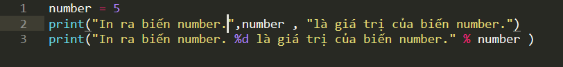
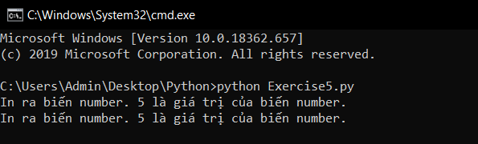

# Chuỗi định dạng trong python #

*Trong bài trước bạn đã học được cách khai báo 1 biến và in biến ra bằng print, bài hôm nay chũng ta sẽ tìm hiểu về chuỗi định dạng, và thêm 1 cách nữa để in biến ra bằng print trong python*

**Trước hết chúng ta cần phải chuỗi là gì?**
Tất cả các ngôn ngữ lập trình đều có kiểu dữ liệu là kiểu chuỗi, và trong Python nó cũng không ngoại lệ. Mỗi khi bạn đặt ""(dấu ngoặc kép) xung quanh 1 đoạn văn bản thì bạn đã tạo ra 1 chuỗi.
*Ví dụ:*
```Python
  print("Đây là 1 chuỗi")
```

**Chuỗi định dạng trong python**
Chuỗi định dạng là chuỗi dùng để định dạng 1 biến, và cũng có thể sử dụng chuỗi định dạng để gọi đến biến.
*Ví dụ:*
```Python
print("Đây là 1 chuỗi định dạng : %s")
```
Như đã nói ở trên, bài hôm nay chúng ta sẽ có thêm 1 cách để in ra 1 biến.
*Thay vì:*
```Python
number = 5
print("In ra biến number.", number, "là giá trị của biến number.")
```
*Chúng ta có thể in ra biến a bằng cách sử dụng chuỗi định dạng như sau:*
```Python
number = 5
print("In ra biến number. %d là giá trị của biến number." % number)
```



Kết quả của 2 câu lệnh này giống nhau:



### Bạn đọc thắc mắc ###
**1. s, d trong "%s" và "%d" là gì?**
  s, d là chữ cái đầu trong định dạng kiểu của biến s : String, d : Decimal, và còn nhiều ký tự khác, chúng ta sẽ học điều này trong bài các kiểu của biến trong python.
