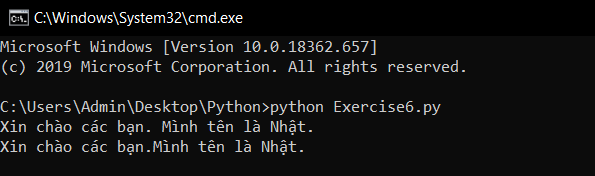
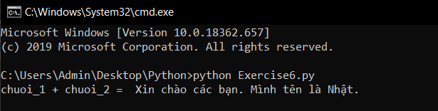

# Nối chuỗi trong python #
Trong bài trước, chúng ta đã học được cách sử dụng chuỗi định dạng để in ra 1 biến. Bài hôm nay chúng ta sẽ học cách nối các chuỗi lại với nhau.

**Mình có 1 ví dụ đơn giản như sau:**

```python
 chuoi = "Mình tên là Nhật."
 print("Xin chào các bạn.",chuoi)
 print("Xin chào các bạn.%s" % chuoi)
```
**Kết quả:**



Nếu bạn cho rằng đó là nối chuỗi thì hẳn bạn đã nhầm lẫn. Ở đây viecj bạn làm chỉ là in ra hai chuỗi liền nhau, bởi vì thứ mà bạn in ra nó vẫn là 2 chuỗi chứ nó không gộp vào 1 chuỗi. Vậy làm như thế nào để nối chuỗi.

Trong python để nối chuỗi người ta dùng toán tử "+".

**Ví dụ:**

```python
chuoi_1 = "Xin chào các bạn. "
chuoi_2 = "Mình tên là Nhật."
chuoi_3 = chuoi_1 + chuoi_2
#Chuoi_3 = "Xin chào các bạn. Mình tên là Nhật."
print("chuoi_1 + chuoi_2 = ",chuoi_3)
```
**Cùng xem kết quả nhé:**



### Thắc mắc bạn đọc ###

**1. Sự khác biệt giữa %r và %s là gì?**

  %s là định dạng dữ liệu kiểu chuỗi(string), còn %r là định dạng dữ liệu kiểu thô(raw).
