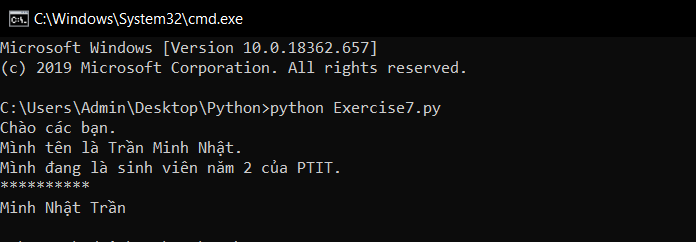

# Những điều thú vị về "print" trong python (Phần 1) #
Bài hôm trước các bạn đã được học nối chuỗi trong python, bài hôm nay chũng ta sẽ tìm hiểu những điều thú vị về câu lệnh "print" trong python.

**Việc của bạn là chỉ cần code lại những gì tôi code ở đây và chạy nó, hãy cố tự tìm hiểu và giải thích tại sao nó lại có kết quả như vậy.**

```python
print("Chào các bạn.")
print("Mình tên là %s" %"Trần Minh Nhật.") #Có gì lạ không nhỉ??
print("Mình đang là sinh viên năm 2 của PTIT.")
print("*" * 10) #đoán xem kết quả sẽ là gì nào??
kitu_1 = 'M'
kitu_2 = 'i'
kitu_3 = 'n'
kitu_4 = 'h'
kitu_5 = 'N'
kitu_6 = 'h'
kitu_7 = 'ậ'
kitu_8 = 't'
kitu_9 = 'T'
kitu_10 = 'r'
kitu_11 = 'ầ'
kitu_12 = 'n'
#Hãy xem tác dụng của end = " " là gì, thử bỏ nó đi xem
print (kitu_1 + kitu_2 + kitu_3 + kitu_4, end = " ")
print(kitu_5 + kitu_6 + kitu_7 + kitu_8, end = " ")
print(kitu_9 + kitu_10 + kitu_11 + kitu_12)

```

**Cùng xem kết quả nhé :**



### Thắc mắc bạn đọc ###

**1. Từ khóa "end" hoạt động như thế nào?**
  Khi bạn gọi đến từ kháo "end" trong print sau khi kết thúc việc in ra màn hình thì ký tự ngắt dòng của bạn sẽ được thay thế bằng ký tự đặt ở trong " " của từ khóa "end".

**2. Tại sao trong ví dụ mình lại sử dụng biến có tên "Trần Minh Nhật.", biến lại vi phạm quy tắc đặt tên mà?**
  Đó thực sự không phải là tên 1 biến, đó là 1 chuỗi, như mình đã nói tên biến không thể bắt đầu bằng kí tự đặc biệt trừ ký tự gạch dưới.

**3. Tôi có thể dùng ' '(ngoặc đơn), thay vì " "(ngoặc kép) để tạo ra 1 chuỗi không??**
  Tất nhiên là có rồi, python không phân biệt " " và ' ', nhưng những lập lình viên thường sử dụng ' ' để tạo 1 ký tự hoặc 1 chuỗi ngắn có 1 từ ('a', 'Từ') còn " " để tạo 1 chuỗi dài có nhiều từ.
