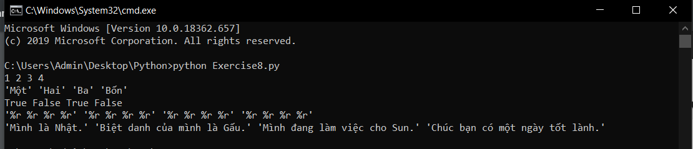

# Những điều thú vị về print trong python (phần 2) #
Tiếp tục với những điều thú vị về print trong python, với những yêu cầu như bài hôm trước( Làm cho code chạy và cố tìm hiểu để giải thích chúng ), chúng ta bắt đàu nhé.

```python
dinh_dang = "%r %r %r %r" #tạo biến định dạng có giá trị nhwu sau.
print (dinh_dang %(1, 2, 3, 4))
print (dinh_dang %('Một', 'Hai', 'Ba', 'Bốn'))
print (dinh_dang %(True, False, True, False ))
print (dinh_dang %(dinh_dang, dinh_dang, dinh_dang, dinh_dang))
print (dinh_dang %("Mình là Nhật.",
 "Biệt danh của mình là Gấu.",
  "Mình đang làm việc cho Sun.",
   "Chúc bạn có một ngày tốt lành."))
```
**Cùng xem kết quả nhé:**



### Thắc mắc bạn đọc ###

**1. Tôi nên dùng %r hay %s để định dạng?**

  Bạn nên sử dụng %s, chỉ nên dùng %r để định dạng những dữ liệu mà chưa rõ kiểu của nó(dữ liệu dạng thô).

**2. Tại sao phải dùng ' ' cho 'Một','Hai'... mà không dùng cho True và False?**

  Nếu như bạn đã tìm hiểu về các biến trong python, thì hẳn bạn phải biết True, False là 2 giá trị của biến kiểu Boolean. Python nhận ra được điều đó nên không cần đặt True và False vào trong dấu ' '.
