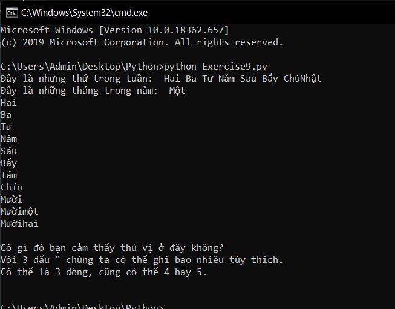

# Những điều thú vị về print trong python (phần 3) #
Lại là những điều thú vị của câu lệnh print trong python, hôm nay chúng sẽ tiếp tục tìm hiểu về chúng.
Hãy code lại đoạn code sau và làm cho chúng hoạt dộng, hãy tìm hiểu tại sao lại chạy ra kết quả như ví dụ dưới đây nhé.

```python
thu = "Hai Ba Tư Năm Sau Bẩy ChủNhật "
thang = "Một\nHai\nBa\nTư\nNăm\nSáu\nBẩy\nTám\nChín\nMười\nMườimột\nMườihai"
print("Đây là nhưng thứ trong tuần: ",thu)
print("Đây là những tháng trong năm: ",thang)
print("""
Có gì đó bạn cảm thấy thú vị ở đây không?
Với 3 dấu " chúng ta có thể ghi bao nhiêu tùy thích.
Có thể là 3 dòng, cũng có thể 4 hay 5.
""")
```
**Kết quả sẽ như sau:**



### Thắc mắc bạn đọc ###

**1. Nếu tôi muốn tháng "Một" cũng bắt đầu trên một dòng mới như 11 tháng còn lại thì phải làm như thế nào?**

  Điều này hết sức đơn giản, bạn chỉ việc thêm "\n" vào trước "Một"(\nMột) như 11 tháng còn lại là được,

**2. Tại sao "\n" không hoạt động khi tôi sử dụng %r?**

  Điều này là do cơ chế hoạt động của %r, nó sẽ in ra đúng như in những gì bạn đã nhập, nó cho rằng đây là dữ liệu dạng thô.
